# Enhanced Physical Data Model - Entity Relationship Diagram (ERD)

## Overview

This ERD provides a visual representation of the Nonna App database schema with clear distinction between the `public` schema (application tables) and references to the `auth` schema (Supabase Auth).

## Legend

- 🔐 **auth schema** - Supabase Auth managed (gray boxes)
- 📦 **public schema** - Application tables (white boxes)
- ⚡ **Realtime enabled** - Tables with real-time subscriptions
- 🔑 **Primary Key** - PK designation
- 🔗 **Foreign Key** - FK designation with CASCADE behavior
- 🎯 **Indexed** - Performance-optimized columns

## Complete ERD with Schema Distinction

```mermaid
erDiagram
    %% ========================================
    %% AUTH SCHEMA (Supabase Managed)
    %% ========================================
    
    AUTH_USERS {
        uuid id PK "🔐 Supabase Auth"
        text email "Login email"
        jsonb raw_user_meta_data "OAuth metadata"
        timestamptz created_at "Account creation"
        timestamptz last_sign_in_at "Last login"
    }

    %% ========================================
    %% PUBLIC SCHEMA - User Identity
    %% ========================================
    
    PROFILES {
        uuid user_id PK,FK "🔗 auth.users(id) ON DELETE CASCADE"
        text display_name "User display name"
        text avatar_url "Profile picture URL"
        boolean biometric_enabled "Biometric auth preference (default false)"
        timestamptz created_at "NOT NULL DEFAULT now()"
        timestamptz updated_at "Auto-updated via trigger"
    }

    USER_STATS {
        uuid user_id PK,FK "🔗 auth.users(id) ON DELETE CASCADE"
        int events_attended_count "⚡ Gamification counter"
        int items_purchased_count "⚡ Auto-incremented"
        int photos_squished_count "⚡ Like counter"
        int comments_added_count "⚡ Engagement counter"
        timestamptz updated_at "Last stats update"
    }

    %% ========================================
    %% PUBLIC SCHEMA - Baby Profiles & Access
    %% ========================================
    
    BABY_PROFILES {
        uuid id PK "🎯 Tenant boundary"
        text name "NOT NULL"
        text default_last_name_source "Father's last name"
        text profile_photo_url "Storage path"
        date expected_birth_date "For countdown"
        text gender "CHECK: male|female|unknown"
        timestamptz created_at "NOT NULL DEFAULT now()"
        timestamptz updated_at "Auto-updated"
    }

    BABY_MEMBERSHIPS {
        uuid id PK
        uuid baby_profile_id FK "🔗 CASCADE"
        uuid user_id FK "🔗 CASCADE"
        text role "CHECK: owner|follower 🎯"
        text relationship_label "Grandma, Aunt, etc."
        timestamptz created_at "NOT NULL DEFAULT now()"
        timestamptz updated_at "Auto-updated"
        timestamptz removed_at "Soft delete"
    }

    INVITATIONS {
        uuid id PK
        uuid baby_profile_id FK "🔗 CASCADE ⚡"
        uuid invited_by_user_id FK "🔗 CASCADE"
        text invitee_email "Target email"
        text token_hash "UNIQUE 🎯 Secure token"
        timestamptz expires_at "7 days from creation"
        text status "CHECK: pending|accepted|revoked|expired"
        timestamptz accepted_at "Acceptance timestamp"
        uuid accepted_by_user_id FK "🔗 SET NULL"
        timestamptz created_at "NOT NULL DEFAULT now()"
        timestamptz updated_at "Auto-updated"
    }

    %% ========================================
    %% PUBLIC SCHEMA - Tile System
    %% ========================================
    
    SCREENS {
        uuid id PK
        text screen_name "UNIQUE 🎯 home, calendar, etc."
        text description "Screen purpose"
        bool is_active "Feature flag"
        timestamptz created_at "NOT NULL DEFAULT now()"
    }

    TILE_DEFINITIONS {
        uuid id PK
        text tile_type "UNIQUE 🎯 PhotoGridTile, etc."
        text description "Tile widget description"
        jsonb schema_params "Parameter validation schema"
        bool is_active "Feature flag"
        timestamptz created_at "NOT NULL DEFAULT now()"
    }

    TILE_CONFIGS {
        uuid id PK
        uuid screen_id FK "🔗 CASCADE"
        uuid tile_definition_id FK "🔗 CASCADE"
        text role "CHECK: owner|follower 🎯"
        int display_order "Sort order"
        bool is_visible "Remote show/hide"
        jsonb params "Tile-specific config"
        timestamptz updated_at "Auto-updated"
    }

    %% ========================================
    %% PUBLIC SCHEMA - Cache Invalidation
    %% ========================================
    
    OWNER_UPDATE_MARKERS {
        uuid id PK
        uuid baby_profile_id FK "UNIQUE 🔗 CASCADE ⚡"
        timestamptz tiles_last_updated_at "Cache key"
        uuid updated_by_user_id FK "🔗 SET NULL"
        text reason "photo_uploaded, event_created, etc."
    }

    %% ========================================
    %% PUBLIC SCHEMA - Calendar
    %% ========================================
    
    EVENTS {
        uuid id PK
        uuid baby_profile_id FK "🔗 CASCADE 🎯 ⚡"
        uuid created_by_user_id FK "🔗 CASCADE"
        text title "NOT NULL"
        timestamptz starts_at "NOT NULL 🎯 Event date/time"
        timestamptz ends_at "Optional end time"
        text description "Event details"
        text location "Physical location"
        text video_link "Zoom/Meet URL"
        text cover_photo_url "Storage path"
        timestamptz created_at "NOT NULL DEFAULT now()"
        timestamptz updated_at "Auto-updated"
    }

    EVENT_RSVPS {
        uuid id PK
        uuid event_id FK "🔗 CASCADE ⚡"
        uuid user_id FK "🔗 CASCADE 🎯"
        text status "CHECK: yes|no|maybe"
        timestamptz created_at "NOT NULL DEFAULT now()"
        timestamptz updated_at "Auto-updated"
    }

    EVENT_COMMENTS {
        uuid id PK
        uuid event_id FK "🔗 CASCADE 🎯 ⚡"
        uuid user_id FK "🔗 CASCADE"
        text body "NOT NULL Comment text"
        timestamptz created_at "NOT NULL DEFAULT now() 🎯"
        timestamptz deleted_at "Soft delete by owner"
        uuid deleted_by_user_id FK "🔗 SET NULL Moderator"
    }

    %% ========================================
    %% PUBLIC SCHEMA - Registry
    %% ========================================
    
    REGISTRY_ITEMS {
        uuid id PK
        uuid baby_profile_id FK "🔗 CASCADE 🎯 ⚡"
        uuid created_by_user_id FK "🔗 CASCADE"
        text name "NOT NULL Item name"
        text description "Item details"
        text link_url "Product URL"
        int priority "Sort order"
        timestamptz created_at "NOT NULL DEFAULT now() 🎯"
        timestamptz updated_at "Auto-updated"
    }

    REGISTRY_PURCHASES {
        uuid id PK
        uuid registry_item_id FK "🔗 CASCADE ⚡"
        uuid purchased_by_user_id FK "🔗 CASCADE"
        timestamptz purchased_at "NOT NULL DEFAULT now()"
        text note "Optional purchaser note"
    }

    %% ========================================
    %% PUBLIC SCHEMA - Photos
    %% ========================================
    
    PHOTOS {
        uuid id PK
        uuid baby_profile_id FK "🔗 CASCADE 🎯 ⚡"
        uuid uploaded_by_user_id FK "🔗 CASCADE"
        text storage_path "NOT NULL Supabase Storage path"
        text caption "Optional photo caption"
        timestamptz created_at "NOT NULL DEFAULT now() 🎯"
        timestamptz updated_at "Auto-updated"
    }

    PHOTO_SQUISHES {
        uuid id PK
        uuid photo_id FK "🔗 CASCADE 🎯 ⚡"
        uuid user_id FK "🔗 CASCADE 🎯"
        timestamptz created_at "NOT NULL DEFAULT now()"
    }

    PHOTO_COMMENTS {
        uuid id PK
        uuid photo_id FK "🔗 CASCADE 🎯 ⚡"
        uuid user_id FK "🔗 CASCADE"
        text body "NOT NULL Comment text"
        timestamptz created_at "NOT NULL DEFAULT now() 🎯"
        timestamptz deleted_at "Soft delete by owner"
        uuid deleted_by_user_id FK "🔗 SET NULL Moderator"
    }

    PHOTO_TAGS {
        uuid id PK
        uuid photo_id FK "🔗 CASCADE 🎯"
        text tag "NOT NULL 🎯 GIN indexed"
        timestamptz created_at "NOT NULL DEFAULT now()"
    }

    %% ========================================
    %% PUBLIC SCHEMA - Gamification
    %% ========================================
    
    VOTES {
        uuid id PK
        uuid baby_profile_id FK "🔗 CASCADE"
        uuid user_id FK "🔗 CASCADE"
        text vote_type "CHECK: gender|birthdate"
        text value_text "For gender votes"
        date value_date "For birthdate votes"
        bool is_anonymous "DEFAULT true"
        timestamptz created_at "NOT NULL DEFAULT now()"
        timestamptz updated_at "Auto-updated"
    }

    NAME_SUGGESTIONS {
        uuid id PK
        uuid baby_profile_id FK "🔗 CASCADE ⚡"
        uuid user_id FK "🔗 CASCADE"
        text gender "CHECK: male|female|unknown"
        text suggested_name "NOT NULL"
        timestamptz created_at "NOT NULL DEFAULT now()"
        timestamptz updated_at "Auto-updated"
    }

    NAME_SUGGESTION_LIKES {
        uuid id PK
        uuid name_suggestion_id FK "🔗 CASCADE 🎯 ⚡"
        uuid user_id FK "🔗 CASCADE 🎯"
        timestamptz created_at "NOT NULL DEFAULT now()"
    }

    %% ========================================
    %% PUBLIC SCHEMA - Notifications & Activity
    %% ========================================
    
    NOTIFICATIONS {
        uuid id PK
        uuid recipient_user_id FK "🔗 CASCADE 🎯 ⚡"
        uuid baby_profile_id FK "🔗 CASCADE"
        text type "NOT NULL Notification type"
        jsonb payload "Deep-link data"
        timestamptz created_at "NOT NULL DEFAULT now() 🎯"
        timestamptz read_at "Unread filter 🎯"
    }

    ACTIVITY_EVENTS {
        uuid id PK
        uuid baby_profile_id FK "🔗 CASCADE 🎯 ⚡"
        uuid actor_user_id FK "🔗 CASCADE"
        text type "NOT NULL Action type"
        jsonb payload "Action details"
        timestamptz created_at "NOT NULL DEFAULT now() 🎯"
    }

    %% ========================================
    %% RELATIONSHIPS
    %% ========================================

    %% Auth Schema Relationships
    AUTH_USERS ||--|| PROFILES : "1:1 has profile"
    AUTH_USERS ||--|| USER_STATS : "1:1 has stats"
    AUTH_USERS ||--o{ BABY_MEMBERSHIPS : "member of"
    AUTH_USERS ||--o{ INVITATIONS : "sent by"
    AUTH_USERS ||--o{ INVITATIONS : "accepted by"
    AUTH_USERS ||--o{ EVENTS : "creates"
    AUTH_USERS ||--o{ EVENT_RSVPS : "RSVPs to"
    AUTH_USERS ||--o{ EVENT_COMMENTS : "comments on"
    AUTH_USERS ||--o{ REGISTRY_ITEMS : "creates"
    AUTH_USERS ||--o{ REGISTRY_PURCHASES : "purchases"
    AUTH_USERS ||--o{ PHOTOS : "uploads"
    AUTH_USERS ||--o{ PHOTO_SQUISHES : "squishes"
    AUTH_USERS ||--o{ PHOTO_COMMENTS : "comments on"
    AUTH_USERS ||--o{ VOTES : "votes"
    AUTH_USERS ||--o{ NAME_SUGGESTIONS : "suggests"
    AUTH_USERS ||--o{ NAME_SUGGESTION_LIKES : "likes"
    AUTH_USERS ||--o{ NOTIFICATIONS : "receives"
    AUTH_USERS ||--o{ ACTIVITY_EVENTS : "acts in"
    AUTH_USERS ||--o{ OWNER_UPDATE_MARKERS : "updates"

    %% Baby Profile Relationships
    BABY_PROFILES ||--o{ BABY_MEMBERSHIPS : "has members"
    BABY_PROFILES ||--o{ INVITATIONS : "invites to"
    BABY_PROFILES ||--|| OWNER_UPDATE_MARKERS : "has marker"
    BABY_PROFILES ||--o{ EVENTS : "has events"
    BABY_PROFILES ||--o{ REGISTRY_ITEMS : "has items"
    BABY_PROFILES ||--o{ PHOTOS : "has photos"
    BABY_PROFILES ||--o{ VOTES : "has votes"
    BABY_PROFILES ||--o{ NAME_SUGGESTIONS : "has suggestions"
    BABY_PROFILES ||--o{ NOTIFICATIONS : "scoped to"
    BABY_PROFILES ||--o{ ACTIVITY_EVENTS : "has activity"

    %% Tile System Relationships
    SCREENS ||--o{ TILE_CONFIGS : "configured with"
    TILE_DEFINITIONS ||--o{ TILE_CONFIGS : "instantiated as"

    %% Content Relationships
    EVENTS ||--o{ EVENT_RSVPS : "has RSVPs"
    EVENTS ||--o{ EVENT_COMMENTS : "has comments"
    REGISTRY_ITEMS ||--o{ REGISTRY_PURCHASES : "purchased as"
    PHOTOS ||--o{ PHOTO_SQUISHES : "squished"
    PHOTOS ||--o{ PHOTO_COMMENTS : "has comments"
    PHOTOS ||--o{ PHOTO_TAGS : "tagged with"
    NAME_SUGGESTIONS ||--o{ NAME_SUGGESTION_LIKES : "liked"
```



## Key Features Highlighted in ERD

### 1. Auth Schema Integration
- Clear visual distinction with 🔐 marker
- All FK relationships use `ON DELETE CASCADE` for automatic cleanup
- Supports Supabase Auth (email/password, OAuth)

### 2. Realtime Tables (⚡)
All tables marked with ⚡ are added to `supabase_realtime` publication for live updates:
- photos, events, event_rsvps, event_comments, photo_comments, photo_squishes
- registry_items, registry_purchases, notifications, owner_update_markers
- baby_memberships, activity_events, name_suggestions, name_suggestion_likes

### 3. Performance Indexes (🎯)
Tables and columns marked with 🎯 have optimized indexes:
- Baby-scoped queries: `baby_profile_id` indexes on all content
- Time-based sorting: `created_at DESC` indexes
- User-scoped queries: `user_id` indexes on interactions
- Text search: GIN index on photo tags

### 4. Data Integrity
- **Primary Keys**: All tables use `uuid` with `gen_random_uuid()`
- **Foreign Keys**: All relationships properly defined with CASCADE behavior
- **Unique Constraints**: Prevent duplicate interactions (one squish per photo, one RSVP per event)
- **CHECK Constraints**: Enforce enums (role, gender, status, vote_type)
- **NOT NULL**: Critical fields require values

### 5. Audit Fields
Every table includes:
- `id uuid PRIMARY KEY DEFAULT gen_random_uuid()`
- `created_at timestamptz NOT NULL DEFAULT now()`
- `updated_at timestamptz NOT NULL DEFAULT now()` (auto-updated via trigger)

### 6. Soft Deletes
Tables supporting soft delete:
- `baby_memberships.removed_at` - Membership revocation
- `event_comments.deleted_at` / `deleted_by_user_id` - Owner moderation
- `photo_comments.deleted_at` / `deleted_by_user_id` - Owner moderation

## Schema Statistics

| Category | Count |
|----------|-------|
| Total Tables | 24 (1 auth + 23 public) |
| Relationships | 45+ foreign keys |
| Indexes | 20+ performance indexes |
| Unique Constraints | 8 business rules |
| Realtime Tables | 15 |
| RLS Policies | 80+ granular policies |
| Triggers | 25+ automation triggers |

## Access Patterns

### Owner Queries (Per Baby)
```sql
-- Owners work with one baby at a time
SELECT * FROM events 
WHERE baby_profile_id = :baby_id
  AND created_by_user_id = auth.uid()
ORDER BY starts_at DESC;
```

### Follower Queries (Aggregated)
```sql
-- Followers see content across all followed babies
SELECT * FROM photos 
WHERE baby_profile_id IN (
  SELECT baby_profile_id 
  FROM baby_memberships 
  WHERE user_id = auth.uid() 
    AND removed_at IS NULL
)
ORDER BY created_at DESC
LIMIT 10;
```

### Cache Invalidation Check
```sql
-- Followers check markers to decide if cache refresh needed
SELECT baby_profile_id, tiles_last_updated_at 
FROM owner_update_markers
WHERE baby_profile_id IN (:followed_baby_ids);
```

## Storage Integration

### Photo Storage Paths
```
Supabase Storage Bucket: baby-photos
├── babies/
│   ├── {baby_profile_id}/
│   │   ├── photos/
│   │   │   ├── {photo_id}.jpg
│   │   │   └── thumbnails/
│   │   │       └── {photo_id}_thumb.jpg
│   │   └── profile/
│   │       └── profile.jpg
```

The `photos.storage_path` column stores the relative path within the bucket.

## RLS Security Model

### Core Principles
1. **Membership-based access**: Users can only access babies they're members of
2. **Role-based permissions**: Owners can write, followers can interact
3. **Owner moderation**: Owners can delete any comment on their content
4. **User ownership**: Users can always manage their own interactions (RSVPs, likes)

### Helper Functions
```sql
-- Check if user is a member
is_baby_member(baby_profile_id, user_id) -> boolean

-- Check if user is an owner
is_baby_owner(baby_profile_id, user_id) -> boolean
```

## Conclusion

This enhanced ERD provides:
- ✅ Clear distinction between auth and public schemas
- ✅ Visual indicators for Realtime, indexing, and constraints
- ✅ Complete relationship mapping
- ✅ Performance optimization markers
- ✅ Supabase-specific features highlighted
- ✅ Production-ready for 10K+ concurrent users

For implementation details, refer to:
- DDL: `supabase/migrations/202512240001_create_schema.sql`
- RLS: `supabase/migrations/202512240002_row_level_security.sql`
- Triggers: `supabase/migrations/202512240003_triggers_functions.sql`
- Realtime: `supabase/REALTIME_CONFIGURATION.md`
