# Nonna App — Physical Data Model (Supabase/Postgres)

This document proposes a **physical** (implementation-ready) data model for the Nonna app based on:
- Requirements in docs/01_discovery/01_requirements/Requirements.md
- Tile system + technical requirements in docs/01_discovery/04_technical_requirements/

It is designed for:
- Strict privacy using **Supabase Auth + Postgres Row Level Security (RLS)**
- Role-driven UI tiles (owner vs follower)
- Fast, cache-friendly reads (followers mostly read cached content until owners post updates)

---

## 1) ER Diagram (Mermaid)

```mermaid
erDiagram
  AUTH_USERS {
    uuid id PK
    text email
    timestamptz created_at
  }

  PROFILES {
    uuid user_id PK
    text display_name
    text avatar_url
    timestamptz created_at
    timestamptz updated_at
  }

  BABY_PROFILES {
    uuid id PK
    text name
    text default_last_name_source
    text profile_photo_url
    date expected_birth_date
    text gender
    timestamptz created_at
    timestamptz updated_at
  }

  BABY_MEMBERSHIPS {
    uuid id PK
    uuid baby_profile_id FK
    uuid user_id FK
    text role "owner|follower"
    text relationship_label
    timestamptz created_at
    timestamptz updated_at
    timestamptz removed_at
  }

  INVITATIONS {
    uuid id PK
    uuid baby_profile_id FK
    uuid invited_by_user_id FK
    text invitee_email
    text token_hash
    timestamptz expires_at
    text status "pending|accepted|revoked|expired"
    timestamptz accepted_at
    uuid accepted_by_user_id FK
    timestamptz created_at
    timestamptz updated_at
  }

  SCREENS {
    uuid id PK
    text screen_name
    text description
    bool is_active
    timestamptz created_at
  }

  TILE_DEFINITIONS {
    uuid id PK
    text tile_type
    text description
    jsonb schema_params
    bool is_active
    timestamptz created_at
  }

  TILE_CONFIGS {
    uuid id PK
    uuid screen_id FK
    uuid tile_definition_id FK
    text role "owner|follower"
    int display_order
    bool is_visible
    jsonb params
    timestamptz updated_at
  }

  OWNER_UPDATE_MARKERS {
    uuid id PK
    uuid baby_profile_id FK
    timestamptz tiles_last_updated_at
    uuid updated_by_user_id FK
    text reason
  }

  EVENTS {
    uuid id PK
    uuid baby_profile_id FK
    uuid created_by_user_id FK
    text title
    timestamptz starts_at
    timestamptz ends_at
    text description
    text location
    text video_link
    text cover_photo_url
    timestamptz created_at
    timestamptz updated_at
  }

  EVENT_RSVPS {
    uuid id PK
    uuid event_id FK
    uuid user_id FK
    text status "yes|no|maybe"
    timestamptz created_at
    timestamptz updated_at
  }

  EVENT_COMMENTS {
    uuid id PK
    uuid event_id FK
    uuid user_id FK
    text body
    timestamptz created_at
    timestamptz deleted_at
    uuid deleted_by_user_id FK
  }

  REGISTRY_ITEMS {
    uuid id PK
    uuid baby_profile_id FK
    uuid created_by_user_id FK
    text name
    text description
    text link_url
    int priority
    timestamptz created_at
    timestamptz updated_at
  }

  REGISTRY_PURCHASES {
    uuid id PK
    uuid registry_item_id FK
    uuid purchased_by_user_id FK
    timestamptz purchased_at
    text note
  }

  PHOTOS {
    uuid id PK
    uuid baby_profile_id FK
    uuid uploaded_by_user_id FK
    text storage_path
    text caption
    timestamptz created_at
    timestamptz updated_at
  }

  PHOTO_SQUISHES {
    uuid id PK
    uuid photo_id FK
    uuid user_id FK
    timestamptz created_at
  }

  PHOTO_COMMENTS {
    uuid id PK
    uuid photo_id FK
    uuid user_id FK
    text body
    timestamptz created_at
    timestamptz deleted_at
    uuid deleted_by_user_id FK
  }

  PHOTO_TAGS {
    uuid id PK
    uuid photo_id FK
    text tag
    timestamptz created_at
  }

  VOTES {
    uuid id PK
    uuid baby_profile_id FK
    uuid user_id FK
    text vote_type "gender|birthdate"
    text value_text
    date value_date
    bool is_anonymous
    timestamptz created_at
    timestamptz updated_at
  }

  NAME_SUGGESTIONS {
    uuid id PK
    uuid baby_profile_id FK
    uuid user_id FK
    text gender "male|female|unknown"
    text suggested_name
    timestamptz created_at
    timestamptz updated_at
  }

  NAME_SUGGESTION_LIKES {
    uuid id PK
    uuid name_suggestion_id FK
    uuid user_id FK
    timestamptz created_at
  }

  NOTIFICATIONS {
    uuid id PK
    uuid recipient_user_id FK
    uuid baby_profile_id FK
    text type
    jsonb payload
    timestamptz created_at
    timestamptz read_at
  }

  ACTIVITY_EVENTS {
    uuid id PK
    uuid baby_profile_id FK
    uuid actor_user_id FK
    text type
    jsonb payload
    timestamptz created_at
  }

  USER_STATS {
    uuid user_id PK
    int events_attended_count
    int items_purchased_count
    int photos_squished_count
    int comments_added_count
    timestamptz updated_at
  }

  AUTH_USERS ||--|| PROFILES : "has"
  AUTH_USERS ||--|| USER_STATS : "has"

  BABY_PROFILES ||--o{ BABY_MEMBERSHIPS : "has"
  AUTH_USERS ||--o{ BABY_MEMBERSHIPS : "member"

  BABY_PROFILES ||--o{ INVITATIONS : "invites"
  AUTH_USERS ||--o{ INVITATIONS : "sent"
  AUTH_USERS ||--o{ INVITATIONS : "accepted"

  SCREENS ||--o{ TILE_CONFIGS : "configures"
  TILE_DEFINITIONS ||--o{ TILE_CONFIGS : "instantiates"

  BABY_PROFILES ||--|| OWNER_UPDATE_MARKERS : "cache-key"
  AUTH_USERS ||--o{ OWNER_UPDATE_MARKERS : "updates"

  BABY_PROFILES ||--o{ EVENTS : "has"
  AUTH_USERS ||--o{ EVENTS : "creates"
  EVENTS ||--o{ EVENT_RSVPS : "has"
  AUTH_USERS ||--o{ EVENT_RSVPS : "rsvps"
  EVENTS ||--o{ EVENT_COMMENTS : "has"
  AUTH_USERS ||--o{ EVENT_COMMENTS : "comments"

  BABY_PROFILES ||--o{ REGISTRY_ITEMS : "has"
  AUTH_USERS ||--o{ REGISTRY_ITEMS : "creates"
  REGISTRY_ITEMS ||--o{ REGISTRY_PURCHASES : "purchased"
  AUTH_USERS ||--o{ REGISTRY_PURCHASES : "purchases"

  BABY_PROFILES ||--o{ PHOTOS : "has"
  AUTH_USERS ||--o{ PHOTOS : "uploads"
  PHOTOS ||--o{ PHOTO_SQUISHES : "liked"
  AUTH_USERS ||--o{ PHOTO_SQUISHES : "squishes"
  PHOTOS ||--o{ PHOTO_COMMENTS : "has"
  AUTH_USERS ||--o{ PHOTO_COMMENTS : "comments"
  PHOTOS ||--o{ PHOTO_TAGS : "tagged"

  BABY_PROFILES ||--o{ VOTES : "has"
  AUTH_USERS ||--o{ VOTES : "votes"

  BABY_PROFILES ||--o{ NAME_SUGGESTIONS : "has"
  AUTH_USERS ||--o{ NAME_SUGGESTIONS : "suggests"
  NAME_SUGGESTIONS ||--o{ NAME_SUGGESTION_LIKES : "liked"
  AUTH_USERS ||--o{ NAME_SUGGESTION_LIKES : "likes"

  AUTH_USERS ||--o{ NOTIFICATIONS : "receives"
  BABY_PROFILES ||--o{ NOTIFICATIONS : "scoped"

  BABY_PROFILES ||--o{ ACTIVITY_EVENTS : "has"
  AUTH_USERS ||--o{ ACTIVITY_EVENTS : "acts"
```



---

## 2) Table Explanations (Simple Terms)

### Identity & user profile
- **AUTH_USERS**: Supabase Auth users (login identities). In Postgres this is typically `auth.users`.
- **PROFILES**: Your app’s “public” user profile fields (display name, avatar). Linked 1:1 to `auth.users`.
- **USER_STATS**: Pre-computed counters for gamification (events attended, items purchased, etc.). Keeps the UI fast.

### Babies, roles, invitations
- **BABY_PROFILES**: The baby hubs (one row per baby). Stores name, expected due date, gender, photo.
- **BABY_MEMBERSHIPS**: Who has access to which baby and with what role.
  - `role = owner|follower`.
  - Followers can optionally store `relationship_label` (Grandma, Aunt, etc.).
- **INVITATIONS**: Email invitation lifecycle (token, expiration, accept/revoke). Used to grant follower access.

### Role-driven tile system (layout/config)
- **SCREENS**: The list of screens/tabs (Home, Calendar, Registry, etc.).
- **TILE_DEFINITIONS**: The catalog of tile types your Flutter app can render (ActivityListTile, PhotoGridTile, etc.).
- **TILE_CONFIGS**: The “layout” that decides which tiles show on which screen for a given role, plus ordering + params.
  - Example params: `{ "limit": 6 }`, `{ "days": 14 }`, etc.

### Cache invalidation marker (the “fast follower” strategy)
- **OWNER_UPDATE_MARKERS**: A tiny row per baby that changes only when an **owner** posts something that should refresh follower caches.
  - Followers can subscribe to this marker (or poll it) and only re-fetch tile data if it changed.

### Calendar
- **EVENTS**: Events for a baby (ultrasound, reveal, etc.). Owners create/edit.
- **EVENT_RSVPS**: RSVP status per user per event.
- **EVENT_COMMENTS**: Comments on events. Owners can delete anyone’s comments via `deleted_at/deleted_by_user_id`.

### Registry
- **REGISTRY_ITEMS**: Registry items per baby.
- **REGISTRY_PURCHASES**: “Purchased” markers with purchaser and timestamp (keeps `REGISTRY_ITEMS` immutable-ish).

### Photos
- **PHOTOS**: Photo metadata + storage path.
- **PHOTO_SQUISHES**: One squish per user per photo.
- **PHOTO_COMMENTS**: Comments with owner moderation.
- **PHOTO_TAGS**: Search tags on photos.

### Gamification
- **VOTES**: Anonymous voting records per user per baby (gender, birthdate). Can enforce anonymity until reveal.
- **NAME_SUGGESTIONS**: One suggestion per user per gender per baby (enforce with a unique constraint).
- **NAME_SUGGESTION_LIKES**: Likes on suggestions (for notifications).

### Activity & notifications
- **ACTIVITY_EVENTS**: Append-only activity stream for “Recent Activity” tiles.
- **NOTIFICATIONS**: Inbox items for push + in-app notifications. Scoped to a baby when relevant.

---

## 3) Example Flow (Owner and Follower)

### Example: Owner flow (Parent)
1. **Owner creates a baby**
   - Insert into `BABY_PROFILES`.
   - Insert into `BABY_MEMBERSHIPS` with `role='owner'`.

2. **Owner invites a follower**
   - Insert into `INVITATIONS` (token, expires in 7 days, status `pending`).

3. **Owner posts content (e.g., uploads a photo)**
   - Insert into `PHOTOS`.
   - Optionally insert into `ACTIVITY_EVENTS` (type: `photo_uploaded`).
   - Update `OWNER_UPDATE_MARKERS.tiles_last_updated_at = now()` for that `baby_profile_id`.
   - Insert into `NOTIFICATIONS` for all followers in `BABY_MEMBERSHIPS` (role follower).

4. **Owner UI tiles**
   - App fetches `TILE_CONFIGS` for role `owner` + current screen.
   - Tiles query per baby (because owner is “working on” one selected baby at a time in edit mode).

### Example: Follower flow (Friends & Family)
1. **Follower accepts invite**
   - Invite link maps to `INVITATIONS`.
   - On accept: set `INVITATIONS.status='accepted'`, set `accepted_by_user_id`.
   - Insert into `BABY_MEMBERSHIPS` with `role='follower'` and `relationship_label`.

2. **Follower opens Home**
   - App loads cached tile data instantly (Hive/Isar).
   - App fetches `TILE_CONFIGS` for role `follower` + screen `home` (cached too).

3. **Follower refresh logic (“only if owner posted something”)**
   - Follower checks `OWNER_UPDATE_MARKERS` for each followed baby.
   - If the marker timestamp is unchanged since last cache → do nothing (use cache).
   - If any marker is newer → re-fetch only the affected tile data and update local cache.

4. **Follower aggregated tiles**
   - Follower tiles can query across all followed babies by reading allowed baby ids from `BABY_MEMBERSHIPS`.
   - Example: Recent photos tile selects recent photos where `baby_profile_id IN (followed babies)` ordered by `created_at desc`.

---

## 4) Notes on Constraints (for implementation)

- Unique constraints you likely want:
  - One squish per user per photo: `unique(photo_id, user_id)` on `PHOTO_SQUISHES`.
  - One name suggestion per user per baby per gender: `unique(baby_profile_id, user_id, gender)` on `NAME_SUGGESTIONS`.
  - One RSVP per user per event: `unique(event_id, user_id)` on `EVENT_RSVPS`.

- RLS model (high level):
  - Read access if `BABY_MEMBERSHIPS` contains `(baby_profile_id, auth.uid())`.
  - Write access for owners only: require membership row with `role='owner'`.
  - Follower writes allowed only on interaction tables (comments, RSVPs, purchases, squishes, votes, name suggestions).

- Tile configs are role-driven:
  - The same tile type can appear on multiple screens by having multiple rows in `TILE_CONFIGS`.

---

## 5) Metadata (Data Dictionary)

This section is a **table-by-table field dictionary**.

Columns:
- **Table**: Physical Postgres table name
- **Column**: Field name
- **Type**: Postgres type (typical)
- **What It Means**: Human meaning
- **How It Gets Set**: Population logic (app / edge / trigger)
- **Why Needed**: Business/UX reason
- **Examples**: 2–3 example values

### 5.1 Identity & Profiles

| Table | Column | Type | What It Means | How It Gets Set | Why Needed | Examples |
|---|---|---|---|---|---|---|
| AUTH_USERS | id | uuid (PK) | Authenticated user id | Created by Supabase Auth | Primary identity for RLS + ownership | `550e8400-e29b-41d4-a716-446655440000`, `3f2504e0-4f89-11d3-9a0c-0305e82c3301` |
| AUTH_USERS | email | text | Login email | Set by Auth provider | Login + invite matching | `parent@example.com`, `grandma@example.com`, `aunt@example.com` |
| AUTH_USERS | created_at | timestamptz | Auth user creation time | Set by Supabase Auth | Audit | `2025-12-22T10:30:00Z`, `2025-01-05T18:00:00Z` |
| PROFILES | user_id | uuid (PK/FK) | Links profile to auth user | Insert on signup/first login (trigger or app) | Separate app profile data from auth | `550e8400-e29b-41d4-a716-446655440000`, `3f2504e0-4f89-11d3-9a0c-0305e82c3301` |
| PROFILES | display_name | text | User display name | User updates in app | Display in UI | `Dipans`, `Grandma Saha`, `Family Friend` |
| PROFILES | avatar_url | text | Profile avatar URL | User uploads/updates | UI personalization | `https://cdn.nonna/avatar1.png`, `https://cdn.nonna/avatar2.jpg` |
| PROFILES | created_at | timestamptz | Profile created time | Default `now()` | Audit | `2025-12-22T10:31:00Z`, `2025-01-05T18:02:00Z` |
| PROFILES | updated_at | timestamptz | Profile last updated | Trigger on update | Cache + sync | `2025-12-22T10:45:00Z`, `2025-12-23T08:10:00Z` |

### 5.2 Babies, Memberships, Invitations

| Table | Column | Type | What It Means | How It Gets Set | Why Needed | Examples |
|---|---|---|---|---|---|---|
| BABY_PROFILES | id | uuid (PK) | Baby profile id | Created when owner creates baby | Tenant boundary for all baby content | `7b9c2c10-1111-4b2a-9a9a-aaaaaaaaaaaa`, `7b9c2c10-2222-4b2a-9a9a-bbbbbbbbbbbb` |
| BABY_PROFILES | name | text | Baby name (or default name) | Owner edits; default logic if blank | Display + announcements | `"Baby Saha"`, `"Aarav"`, `"Mia"` |
| BABY_PROFILES | expected_birth_date | date | Due date | Owner edits | Countdown tile + AI suggestions | `2026-01-05`, `2025-12-30`, `NULL` |
| BABY_PROFILES | gender | text | male/female/unknown | Owner edits | Tiles + voting rules | `male`, `female`, `unknown` |
| BABY_PROFILES | profile_photo_url | text | Baby profile photo | Owner uploads/updates | UI identity | `https://cdn.nonna/babies/b1.png`, `NULL` |
| BABY_PROFILES | created_at | timestamptz | Created time | Default `now()` | Audit | `2025-12-01T09:00:00Z`, `2025-12-20T15:30:00Z` |
| BABY_PROFILES | updated_at | timestamptz | Last updated | Trigger on update | Cache + sync | `2025-12-22T10:00:00Z`, `2025-12-23T12:15:00Z` |
| BABY_MEMBERSHIPS | id | uuid (PK) | Access row id | Insert on baby creation (owner) or invite acceptance (follower) | Defines who can see a baby | `9c2f...`, `b17e...` |
| BABY_MEMBERSHIPS | baby_profile_id | uuid (FK) | Which baby is shared | Set on insert | Core RLS join key | `7b9c2c10-1111-4b2a-9a9a-aaaaaaaaaaaa`, `7b9c2c10-2222-4b2a-9a9a-bbbbbbbbbbbb` |
| BABY_MEMBERSHIPS | user_id | uuid (FK) | Which user has access | Set on insert | Permissions | `550e8400-e29b-41d4-a716-446655440000`, `3f2504e0-4f89-11d3-9a0c-0305e82c3301` |
| BABY_MEMBERSHIPS | role | text | owner/follower | Set on insert | Determines allowed writes | `owner`, `follower` |
| BABY_MEMBERSHIPS | relationship_label | text | Follower relationship (Grandma, etc.) | Collected at acceptance | Personalization | `Grandma`, `Aunt`, `Family Friend` |
| BABY_MEMBERSHIPS | removed_at | timestamptz | When access removed | Set on revoke/leave | Soft delete for audit | `NULL`, `2026-02-01T12:00:00Z` |
| INVITATIONS | id | uuid (PK) | Invitation id | Insert by owner invite flow | Tracks lifecycle | `4df1...`, `aa21...` |
| INVITATIONS | baby_profile_id | uuid (FK) | Baby being invited to | Set by owner | Links invite to baby | `7b9c2c10-1111-4b2a-9a9a-aaaaaaaaaaaa`, `7b9c2c10-2222-4b2a-9a9a-bbbbbbbbbbbb` |
| INVITATIONS | invited_by_user_id | uuid (FK) | Sender (owner) | From `auth.uid()` | Audit + permissions | `550e8400-e29b-41d4-a716-446655440000` |
| INVITATIONS | invitee_email | text | Who is invited | Owner input | Email delivery | `grandma@example.com`, `aunt@example.com` |
| INVITATIONS | token_hash | text | Hashed token | Generated server-side | Secure invite verification | `sha256:...`, `argon2:...` |
| INVITATIONS | expires_at | timestamptz | Expiration (7 days) | Set at creation | Meets requirement | `2025-12-29T10:00:00Z`, `2025-12-30T15:30:00Z` |
| INVITATIONS | status | text | pending/accepted/revoked/expired | Updated by accept/revoke/expiry job | Controls access | `pending`, `accepted`, `revoked` |
| INVITATIONS | accepted_by_user_id | uuid (FK) | Accepting user | Set on accept | Links to membership | `3f2504e0-4f89-11d3-9a0c-0305e82c3301`, `NULL` |

### 5.3 Role-Driven Screen + Tile Config

| Table | Column | Type | What It Means | How It Gets Set | Why Needed | Examples |
|---|---|---|---|---|---|---|
| SCREENS | id | uuid (PK) | Screen id | Seeded/configured | Stable FK for configs | `home_id`, `calendar_id` |
| SCREENS | screen_name | text | home/calendar/registry/etc | Seeded/configured | Fetch correct screen config | `home`, `calendar`, `registry` |
| TILE_DEFINITIONS | id | uuid (PK) | Tile definition id | Seeded/configured | Stable FK for tile types | `tile_photo_grid_id`, `tile_activity_list_id` |
| TILE_DEFINITIONS | tile_type | text | Tile type key | Seeded/configured | Used by TileFactory | `PhotoGridTile`, `ActivityListTile`, `CountdownTile` |
| TILE_CONFIGS | id | uuid (PK) | Tile placement row | Seeded/admin-managed | Allows remote config | `cfg_home_photos_follower`, `cfg_home_activity_owner` |
| TILE_CONFIGS | screen_id | uuid (FK) | Which screen | Admin sets | Determines where tile appears | `home_id`, `calendar_id` |
| TILE_CONFIGS | tile_definition_id | uuid (FK) | Which tile type | Admin sets | Determines tile widget | `tile_photo_grid_id`, `tile_activity_list_id` |
| TILE_CONFIGS | role | text | owner/follower | Admin sets | Role-driven composition | `owner`, `follower` |
| TILE_CONFIGS | display_order | int | Sort order | Admin sets | Controls ordering | `10`, `20`, `30` |
| TILE_CONFIGS | is_visible | bool | Visibility flag | Admin sets | Remote show/hide | `true`, `false` |
| TILE_CONFIGS | params | jsonb | Tile params (limit, days) | Admin sets | Tune tile behavior | `{ "limit": 6 }`, `{ "days": 14 }`, `{}` |
| TILE_CONFIGS | updated_at | timestamptz | Last change | Trigger on update | Config cache invalidation | `2025-12-22T11:00:00Z`, `2025-12-23T09:20:00Z` |

### 5.4 Owner Update Marker (Follower Cache Invalidation)

| Table | Column | Type | What It Means | How It Gets Set | Why Needed | Examples |
|---|---|---|---|---|---|---|
| OWNER_UPDATE_MARKERS | baby_profile_id | uuid (FK, unique) | One marker per baby | Insert at baby creation | Lets followers check “did owner update?” cheaply | `7b9c2c10-1111-4b2a-9a9a-aaaaaaaaaaaa`, `7b9c2c10-2222-4b2a-9a9a-bbbbbbbbbbbb` |
| OWNER_UPDATE_MARKERS | tiles_last_updated_at | timestamptz | Last meaningful content update | Updated by owner actions (photo/event/registry/etc) | Followers refresh only when necessary | `2025-12-22T12:00:00Z`, `2025-12-23T07:45:00Z` |
| OWNER_UPDATE_MARKERS | updated_by_user_id | uuid (FK) | Which owner caused update | Set by write trigger/edge function | Audit | `550e8400-e29b-41d4-a716-446655440000` |
| OWNER_UPDATE_MARKERS | reason | text | Reason code | Set by update logic | Debugging/analytics | `photo_uploaded`, `event_created`, `registry_item_added` |

### 5.5 Calendar (Events, RSVPs, Comments)

| Table | Column | Type | What It Means | How It Gets Set | Why Needed | Examples |
|---|---|---|---|---|---|---|
| EVENTS | id | uuid (PK) | Event id | Owner creates event | Primary event record | `e1d2...`, `a9b8...` |
| EVENTS | baby_profile_id | uuid (FK) | Which baby this event belongs to | Set on insert | RLS scoping | `7b9c2c10-1111-4b2a-9a9a-aaaaaaaaaaaa`, `7b9c2c10-2222-4b2a-9a9a-bbbbbbbbbbbb` |
| EVENTS | created_by_user_id | uuid (FK) | Owner who created | From `auth.uid()` | Audit | `550e8400-e29b-41d4-a716-446655440000` |
| EVENTS | title | text | Event name | Owner input | UI display | "Baby Shower", "Doctor Appointment", "Gender Reveal" |
| EVENTS | starts_at | timestamptz | Start date/time | Owner input | Sorting + reminders | `2026-01-10T17:00:00Z`, `2025-12-28T09:30:00Z` |
| EVENTS | ends_at | timestamptz | End date/time | Owner input (optional) | Display + duration | `2026-01-10T20:00:00Z`, `NULL` |
| EVENTS | description | text | Details | Owner input | Context | "Bring snacks", "OBGYN visit", `NULL` |
| EVENTS | location | text | Physical location | Owner input (optional) | UX | "Community Center", "123 Main St", `NULL` |
| EVENTS | video_link | text | Video conference URL | Owner input (optional) | Remote participation | "https://zoom.us/j/123...", `NULL` |
| EVENTS | cover_photo_url | text | Optional cover image | Owner upload (optional) | Visuals | `https://cdn.nonna/events/e1.png`, `NULL` |
| EVENT_RSVPS | event_id | uuid (FK) | Which event | Set on RSVP | One RSVP per user per event | `e1d2...`, `a9b8...` |
| EVENT_RSVPS | user_id | uuid (FK) | Who RSVPed | From `auth.uid()` | Track participation | `3f2504e0-4f89-11d3-9a0c-0305e82c3301`, `8f14e45f-ea...` |
| EVENT_RSVPS | status | text | yes/no/maybe | Follower input | RSVP feature | `yes`, `maybe`, `no` |
| EVENT_COMMENTS | event_id | uuid (FK) | Which event | Set on comment | Threading | `e1d2...`, `a9b8...` |
| EVENT_COMMENTS | user_id | uuid (FK) | Who commented | From `auth.uid()` | Attribution | `3f2504e0-4f89-11d3-9a0c-0305e82c3301`, `550e8400-e29b-41d4-a716-446655440000` |
| EVENT_COMMENTS | body | text | Comment text | User input | Engagement | "Can't wait!", "I'll bring cupcakes", "What time?" |
| EVENT_COMMENTS | deleted_at | timestamptz | Soft delete time | Owner moderation | Owner can delete any comment | `NULL`, `2025-12-23T09:00:00Z` |
| EVENT_COMMENTS | deleted_by_user_id | uuid (FK) | Moderator user | From `auth.uid()` | Audit | `NULL`, `550e8400-e29b-41d4-a716-446655440000` |

### 5.6 Registry (Items + Purchases)

| Table | Column | Type | What It Means | How It Gets Set | Why Needed | Examples |
|---|---|---|---|---|---|---|
| REGISTRY_ITEMS | id | uuid (PK) | Registry item id | Owner creates | Registry core | `item1...`, `item2...` |
| REGISTRY_ITEMS | baby_profile_id | uuid (FK) | Which baby | Set on insert | RLS scoping | `7b9c2c10-1111-4b2a-9a9a-aaaaaaaaaaaa`, `7b9c2c10-2222-4b2a-9a9a-bbbbbbbbbbbb` |
| REGISTRY_ITEMS | created_by_user_id | uuid (FK) | Owner who added | From `auth.uid()` | Audit | `550e8400-e29b-41d4-a716-446655440000` |
| REGISTRY_ITEMS | name | text | Item name | Owner input | Display | "Stroller", "Crib", "Diapers (Size 1)" |
| REGISTRY_ITEMS | description | text | Details | Owner input (optional) | Context | "Lightweight", "Any brand", `NULL` |
| REGISTRY_ITEMS | link_url | text | Product link | Owner input (optional) | Shopping | "https://example.com/stroller", "https://amazon.com/..." |
| REGISTRY_ITEMS | priority | int | Priority rank | Owner input (optional) | Sorting/highlights | `1`, `2`, `3` |
| REGISTRY_PURCHASES | registry_item_id | uuid (FK) | Which item purchased | Follower action | Purchase tracking | `item1...`, `item2...` |
| REGISTRY_PURCHASES | purchased_by_user_id | uuid (FK) | Who purchased | From `auth.uid()` | Display purchaser name | `3f2504e0-4f89-11d3-9a0c-0305e82c3301`, `8f14e45f-ea...` |
| REGISTRY_PURCHASES | purchased_at | timestamptz | When purchased | Default `now()` | Ordering + audit | `2025-12-22T10:05:00Z`, `2025-12-23T08:00:00Z` |
| REGISTRY_PURCHASES | note | text | Optional note | Follower input (optional) | UX | "Congrats!", "From all of us", `NULL` |

### 5.7 Photos (Media + Interactions)

| Table | Column | Type | What It Means | How It Gets Set | Why Needed | Examples |
|---|---|---|---|---|---|---|
| PHOTOS | id | uuid (PK) | Photo row id | Owner uploads | Photo gallery core | `photo1...`, `photo2...` |
| PHOTOS | baby_profile_id | uuid (FK) | Which baby | Set on upload | RLS scoping | `7b9c2c10-1111-4b2a-9a9a-aaaaaaaaaaaa`, `7b9c2c10-2222-4b2a-9a9a-bbbbbbbbbbbb` |
| PHOTOS | uploaded_by_user_id | uuid (FK) | Uploader (owner) | From `auth.uid()` | Audit | `550e8400-e29b-41d4-a716-446655440000` |
| PHOTOS | storage_path | text | Storage object path | Set by upload pipeline | Fetch the image file | `babies/b1/photos/p1.jpg`, `babies/b2/photos/p2.png` |
| PHOTOS | caption | text | Photo caption | Owner input (optional) | Context | "20 weeks!", "First onesie", `NULL` |
| PHOTO_SQUISHES | photo_id | uuid (FK) | Which photo got squished | Follower action | Like feature | `photo1...`, `photo2...` |
| PHOTO_SQUISHES | user_id | uuid (FK) | Who squished | From `auth.uid()` | Prevent double-like | `3f2504e0-4f89-11d3-9a0c-0305e82c3301`, `8f14e45f-ea...` |
| PHOTO_COMMENTS | photo_id | uuid (FK) | Which photo | User comment | Threading | `photo1...`, `photo2...` |
| PHOTO_COMMENTS | user_id | uuid (FK) | Comment author | From `auth.uid()` | Attribution | `3f2504e0-4f89-11d3-9a0c-0305e82c3301`, `550e8400-e29b-41d4-a716-446655440000` |
| PHOTO_COMMENTS | body | text | Comment text | User input | Engagement | "So cute!", "Love this", "Adorable" |
| PHOTO_COMMENTS | deleted_at | timestamptz | Soft delete time | Owner moderation | Owner can delete any comment | `NULL`, `2025-12-23T09:00:00Z` |
| PHOTO_COMMENTS | deleted_by_user_id | uuid (FK) | Moderator user | From `auth.uid()` | Audit | `NULL`, `550e8400-e29b-41d4-a716-446655440000` |
| PHOTO_TAGS | photo_id | uuid (FK) | Which photo | Owner tagging | Search | `photo1...`, `photo2...` |
| PHOTO_TAGS | tag | text | Keyword tag | Owner input | Search | "ultrasound", "milestone", "family" |

### 5.8 Gamification (Votes, Name Suggestions)

| Table | Column | Type | What It Means | How It Gets Set | Why Needed | Examples |
|---|---|---|---|---|---|---|
| VOTES | id | uuid (PK) | Vote row id | Insert on vote | Stores one user’s vote | `vote1...`, `vote2...` |
| VOTES | baby_profile_id | uuid (FK) | Which baby | Set on vote | RLS scoping | `7b9c2c10-1111-4b2a-9a9a-aaaaaaaaaaaa`, `7b9c2c10-2222-4b2a-9a9a-bbbbbbbbbbbb` |
| VOTES | user_id | uuid (FK) | Who voted | From `auth.uid()` | Prevent duplicate votes | `3f2504e0-4f89-11d3-9a0c-0305e82c3301`, `8f14e45f-ea...` |
| VOTES | vote_type | text | gender/birthdate | App enum | Separate vote categories | `gender`, `birthdate` |
| VOTES | value_text | text | Text vote value | App sets (e.g., gender) | Stores non-date choices | `boy`, `girl`, `unknown` |
| VOTES | value_date | date | Date vote value | App sets (e.g., predicted birth date) | Stores date choices | `2026-01-02`, `2026-01-10`, `NULL` |
| VOTES | is_anonymous | bool | Hide voter identity until reveal | Default true; enforced by UI | Requirement: anonymous until reveal | `true`, `false` |
| NAME_SUGGESTIONS | id | uuid (PK) | Suggestion id | Insert on suggestion | Stores suggestion | `ns1...`, `ns2...` |
| NAME_SUGGESTIONS | baby_profile_id | uuid (FK) | Which baby | Set on suggestion | RLS scoping | `7b9c2c10-1111-4b2a-9a9a-aaaaaaaaaaaa`, `7b9c2c10-2222-4b2a-9a9a-bbbbbbbbbbbb` |
| NAME_SUGGESTIONS | user_id | uuid (FK) | Who suggested | From `auth.uid()` | Enforce per-user limits | `3f2504e0-4f89-11d3-9a0c-0305e82c3301`, `8f14e45f-ea...` |
| NAME_SUGGESTIONS | gender | text | male/female/unknown | User input | Requirement: 1 per gender | `male`, `female`, `unknown` |
| NAME_SUGGESTIONS | suggested_name | text | Proposed name | User input | Core feature | "Aarav", "Mia", "Noah" |
| NAME_SUGGESTION_LIKES | name_suggestion_id | uuid (FK) | Which suggestion liked | User action | Engagement + notifications | `ns1...`, `ns2...` |
| NAME_SUGGESTION_LIKES | user_id | uuid (FK) | Who liked | From `auth.uid()` | Prevent duplicate likes | `550e8400-e29b-41d4-a716-446655440000`, `3f2504e0-4f89-11d3-9a0c-0305e82c3301` |

### 5.9 Notifications & Activity

| Table | Column | Type | What It Means | How It Gets Set | Why Needed | Examples |
|---|---|---|---|---|---|---|
| NOTIFICATIONS | id | uuid (PK) | Notification id | Insert by backend logic | In-app inbox + push | `n1...`, `n2...` |
| NOTIFICATIONS | recipient_user_id | uuid (FK) | Who receives | Determined by membership rules | Deliver to correct users | `3f2504e0-4f89-11d3-9a0c-0305e82c3301`, `8f14e45f-ea...` |
| NOTIFICATIONS | baby_profile_id | uuid (FK) | Related baby (if any) | Set by event source | Scope/filter in UI | `7b9c2c10-1111-4b2a-9a9a-aaaaaaaaaaaa`, `NULL` |
| NOTIFICATIONS | type | text | Notification type | Set by backend | Client renders message | `photo_added`, `event_updated`, `registry_purchased` |
| NOTIFICATIONS | payload | jsonb | Structured details | Set by backend | Lets UI deep-link | `{ "photo_id": "photo1..." }`, `{ "event_id": "e1d2..." }` |
| NOTIFICATIONS | created_at | timestamptz | When created | Default `now()` | Ordering | `2025-12-23T07:50:00Z`, `2025-12-23T08:05:00Z` |
| NOTIFICATIONS | read_at | timestamptz | When read | Set by client | Unread counts | `NULL`, `2025-12-23T09:00:00Z` |
| ACTIVITY_EVENTS | id | uuid (PK) | Activity id | Insert on notable actions | Recent Activity tiles | `a1...`, `a2...` |
| ACTIVITY_EVENTS | baby_profile_id | uuid (FK) | Related baby | Set by source | Scope by baby | `7b9c2c10-1111-4b2a-9a9a-aaaaaaaaaaaa`, `7b9c2c10-2222-4b2a-9a9a-bbbbbbbbbbbb` |
| ACTIVITY_EVENTS | actor_user_id | uuid (FK) | Who did the action | From `auth.uid()` | Attribution | `550e8400-e29b-41d4-a716-446655440000`, `3f2504e0-4f89-11d3-9a0c-0305e82c3301` |
| ACTIVITY_EVENTS | type | text | Action type | Backend/app enum | Rendering logic | `photo_uploaded`, `comment_added`, `rsvp_updated` |
| ACTIVITY_EVENTS | payload | jsonb | Action details | Backend/app sets | Flexible activity display | `{ "photo_id": "photo1..." }`, `{ "comment_id": "pcmt1..." }` |
| ACTIVITY_EVENTS | created_at | timestamptz | When happened | Default `now()` | Sorting | `2025-12-23T07:51:00Z`, `2025-12-23T08:06:00Z` |

### 5.10 User Stats (Counters)

| Table | Column | Type | What It Means | How It Gets Set | Why Needed | Examples |
|---|---|---|---|---|---|---|
| USER_STATS | user_id | uuid (PK/FK) | Which user | Insert once per user | One row per user | `550e8400-e29b-41d4-a716-446655440000`, `3f2504e0-4f89-11d3-9a0c-0305e82c3301` |
| USER_STATS | events_attended_count | int | Count of events attended | Updated via trigger/job when RSVP yes | Gamification counters | `0`, `3`, `12` |
| USER_STATS | items_purchased_count | int | Count of items purchased | Updated when purchase created | Gamification counters | `0`, `1`, `5` |
| USER_STATS | photos_squished_count | int | Count of squishes | Updated when squish created | Gamification counters | `0`, `7`, `25` |
| USER_STATS | comments_added_count | int | Count of comments | Updated when comments created | Gamification counters | `0`, `4`, `18` |
| USER_STATS | updated_at | timestamptz | Last stats refresh | Trigger/job | Cache/sync | `2025-12-23T08:10:00Z`, `2025-12-23T09:05:00Z` |

---

## Appendix — Suggested Indexes + Unique Constraints + RLS Policy Sketch

### A) Suggested Indexes

```sql
-- Membership checks (helps app queries and RLS EXISTS subqueries)
create index if not exists idx_baby_memberships_user_active
  on public.baby_memberships (user_id)
  where removed_at is null;

create index if not exists idx_baby_memberships_baby_active
  on public.baby_memberships (baby_profile_id)
  where removed_at is null;

-- Screen tiles: fetch by screen + role in a stable order
create index if not exists idx_tile_configs_screen_role_order
  on public.tile_configs (screen_id, role, display_order)
  where is_visible = true;

-- Owner update markers: one row per baby + fast lookups
create unique index if not exists uq_owner_update_markers_baby
  on public.owner_update_markers (baby_profile_id);

-- Baby-scoped feeds
create index if not exists idx_events_baby_starts
  on public.events (baby_profile_id, starts_at desc);

create index if not exists idx_photos_baby_created
  on public.photos (baby_profile_id, created_at desc);

create index if not exists idx_registry_items_baby_created
  on public.registry_items (baby_profile_id, created_at desc);

-- Conversations
create index if not exists idx_event_comments_event_created
  on public.event_comments (event_id, created_at desc)
  where deleted_at is null;

create index if not exists idx_photo_comments_photo_created
  on public.photo_comments (photo_id, created_at desc)
  where deleted_at is null;

-- Inbox
create index if not exists idx_notifications_recipient_created
  on public.notifications (recipient_user_id, created_at desc);

create index if not exists idx_notifications_recipient_unread
  on public.notifications (recipient_user_id, created_at desc)
  where read_at is null;
```

### B) Suggested Unique Constraints

```sql
-- One active membership per user per baby
create unique index if not exists uq_baby_memberships_baby_user_active
  on public.baby_memberships (baby_profile_id, user_id)
  where removed_at is null;

-- Prevent duplicate interactions
create unique index if not exists uq_event_rsvps_event_user
  on public.event_rsvps (event_id, user_id);

create unique index if not exists uq_photo_squishes_photo_user
  on public.photo_squishes (photo_id, user_id);

create unique index if not exists uq_name_suggestion_likes_suggestion_user
  on public.name_suggestion_likes (name_suggestion_id, user_id);

-- Optional: stable identifiers
create unique index if not exists uq_screens_screen_name
  on public.screens (screen_name);

create unique index if not exists uq_tile_definitions_tile_type
  on public.tile_definitions (tile_type);
```

### C) Supabase RLS Policy Sketch

High-level rules:
- A user can **read** baby-scoped content if they are an **active member** (`baby_memberships.removed_at is null`).
- Only **owners** can **create/update/delete** owner-managed content (events/photos/registry + tags).
- Followers can create interaction rows for themselves (RSVPs, comments, squishes, likes, votes, name suggestions) within babies they have access to.

```sql
-- Enable RLS (representative; apply to all baby-scoped tables)
alter table public.events enable row level security;
alter table public.photos enable row level security;
alter table public.registry_items enable row level security;
alter table public.event_rsvps enable row level security;
alter table public.event_comments enable row level security;
alter table public.photo_squishes enable row level security;
alter table public.photo_comments enable row level security;
alter table public.owner_update_markers enable row level security;

-- EVENTS: members read
create policy "events_select_for_members"
  on public.events
  for select
  using (
    exists (
      select 1
      from public.baby_memberships bm
      where bm.baby_profile_id = events.baby_profile_id
        and bm.user_id = auth.uid()
        and bm.removed_at is null
    )
  );

-- EVENTS: owners write
create policy "events_write_for_owners"
  on public.events
  for all
  using (
    exists (
      select 1
      from public.baby_memberships bm
      where bm.baby_profile_id = events.baby_profile_id
        and bm.user_id = auth.uid()
        and bm.role = 'owner'
        and bm.removed_at is null
    )
  )
  with check (
    exists (
      select 1
      from public.baby_memberships bm
      where bm.baby_profile_id = events.baby_profile_id
        and bm.user_id = auth.uid()
        and bm.role = 'owner'
        and bm.removed_at is null
    )
  );

-- EVENT_RSVPS: members can insert/update only their own RSVP
create policy "event_rsvps_insert_self"
  on public.event_rsvps
  for insert
  with check (user_id = auth.uid());

create policy "event_rsvps_update_self"
  on public.event_rsvps
  for update
  using (user_id = auth.uid())
  with check (user_id = auth.uid());

-- OWNER_UPDATE_MARKERS: members read, owners update
create policy "markers_select_for_members"
  on public.owner_update_markers
  for select
  using (
    exists (
      select 1
      from public.baby_memberships bm
      where bm.baby_profile_id = owner_update_markers.baby_profile_id
        and bm.user_id = auth.uid()
        and bm.removed_at is null
    )
  );

create policy "markers_update_for_owners"
  on public.owner_update_markers
  for update
  using (
    exists (
      select 1
      from public.baby_memberships bm
      where bm.baby_profile_id = owner_update_markers.baby_profile_id
        and bm.user_id = auth.uid()
        and bm.role = 'owner'
        and bm.removed_at is null
    )
  )
  with check (
    exists (
      select 1
      from public.baby_memberships bm
      where bm.baby_profile_id = owner_update_markers.baby_profile_id
        and bm.user_id = auth.uid()
        and bm.role = 'owner'
        and bm.removed_at is null
    )
  );
```
