# Nonna App — Physical Data Model (Supabase/Postgres)

This document proposes a **physical** (implementation-ready) data model for the Nonna app based on:
- Requirements in docs/01_discovery/01_requirements/Requirements.md
- Tile system + technical requirements in docs/01_discovery/04_technical_requirements/

It is designed for:
- Strict privacy using **Supabase Auth + Postgres Row Level Security (RLS)**
- Role-driven UI tiles (owner vs follower)
- Fast, cache-friendly reads (followers mostly read cached content until owners post updates)

---

## 1) ER Diagram (Mermaid)

```mermaid
erDiagram
  AUTH_USERS {
    uuid id PK
    text email
    timestamptz created_at
  }

  PROFILES {
    uuid user_id PK
    text display_name
    text avatar_url
    timestamptz created_at
    timestamptz updated_at
  }

  BABY_PROFILES {
    uuid id PK
    text name
    text default_last_name_source
    text profile_photo_url
    date expected_birth_date
    text gender
    timestamptz created_at
    timestamptz updated_at
  }

  BABY_MEMBERSHIPS {
    uuid id PK
    uuid baby_profile_id FK
    uuid user_id FK
    text role "owner|follower"
    text relationship_label
    timestamptz created_at
    timestamptz updated_at
    timestamptz removed_at
  }

  INVITATIONS {
    uuid id PK
    uuid baby_profile_id FK
    uuid invited_by_user_id FK
    text invitee_email
    text token_hash
    timestamptz expires_at
    text status "pending|accepted|revoked|expired"
    timestamptz accepted_at
    uuid accepted_by_user_id FK
    timestamptz created_at
    timestamptz updated_at
  }

  SCREENS {
    uuid id PK
    text screen_name
    text description
    bool is_active
    timestamptz created_at
  }

  TILE_DEFINITIONS {
    uuid id PK
    text tile_type
    text description
    jsonb schema_params
    bool is_active
    timestamptz created_at
  }

  TILE_CONFIGS {
    uuid id PK
    uuid screen_id FK
    uuid tile_definition_id FK
    text role "owner|follower"
    int display_order
    bool is_visible
    jsonb params
    timestamptz updated_at
  }

  OWNER_UPDATE_MARKERS {
    uuid id PK
    uuid baby_profile_id FK
    timestamptz tiles_last_updated_at
    uuid updated_by_user_id FK
    text reason
  }

  EVENTS {
    uuid id PK
    uuid baby_profile_id FK
    uuid created_by_user_id FK
    text title
    timestamptz starts_at
    timestamptz ends_at
    text description
    text location
    text video_link
    text cover_photo_url
    timestamptz created_at
    timestamptz updated_at
  }

  EVENT_RSVPS {
    uuid id PK
    uuid event_id FK
    uuid user_id FK
    text status "yes|no|maybe"
    timestamptz created_at
    timestamptz updated_at
  }

  EVENT_COMMENTS {
    uuid id PK
    uuid event_id FK
    uuid user_id FK
    text body
    timestamptz created_at
    timestamptz deleted_at
    uuid deleted_by_user_id FK
  }

  REGISTRY_ITEMS {
    uuid id PK
    uuid baby_profile_id FK
    uuid created_by_user_id FK
    text name
    text description
    text link_url
    int priority
    timestamptz created_at
    timestamptz updated_at
  }

  REGISTRY_PURCHASES {
    uuid id PK
    uuid registry_item_id FK
    uuid purchased_by_user_id FK
    timestamptz purchased_at
    text note
  }

  PHOTOS {
    uuid id PK
    uuid baby_profile_id FK
    uuid uploaded_by_user_id FK
    text storage_path
    text caption
    timestamptz created_at
    timestamptz updated_at
  }

  PHOTO_SQUISHES {
    uuid id PK
    uuid photo_id FK
    uuid user_id FK
    timestamptz created_at
  }

  PHOTO_COMMENTS {
    uuid id PK
    uuid photo_id FK
    uuid user_id FK
    text body
    timestamptz created_at
    timestamptz deleted_at
    uuid deleted_by_user_id FK
  }

  PHOTO_TAGS {
    uuid id PK
    uuid photo_id FK
    text tag
    timestamptz created_at
  }

  VOTES {
    uuid id PK
    uuid baby_profile_id FK
    uuid user_id FK
    text vote_type "gender|birthdate"
    text value_text
    date value_date
    bool is_anonymous
    timestamptz created_at
    timestamptz updated_at
  }

  NAME_SUGGESTIONS {
    uuid id PK
    uuid baby_profile_id FK
    uuid user_id FK
    text gender "male|female|unknown"
    text suggested_name
    timestamptz created_at
    timestamptz updated_at
  }

  NAME_SUGGESTION_LIKES {
    uuid id PK
    uuid name_suggestion_id FK
    uuid user_id FK
    timestamptz created_at
  }

  NOTIFICATIONS {
    uuid id PK
    uuid recipient_user_id FK
    uuid baby_profile_id FK
    text type
    jsonb payload
    timestamptz created_at
    timestamptz read_at
  }

  ACTIVITY_EVENTS {
    uuid id PK
    uuid baby_profile_id FK
    uuid actor_user_id FK
    text type
    jsonb payload
    timestamptz created_at
  }

  USER_STATS {
    uuid user_id PK
    int events_attended_count
    int items_purchased_count
    int photos_squished_count
    int comments_added_count
    timestamptz updated_at
  }

  AUTH_USERS ||--|| PROFILES : "has"
  AUTH_USERS ||--|| USER_STATS : "has"

  BABY_PROFILES ||--o{ BABY_MEMBERSHIPS : "has"
  AUTH_USERS ||--o{ BABY_MEMBERSHIPS : "member"

  BABY_PROFILES ||--o{ INVITATIONS : "invites"
  AUTH_USERS ||--o{ INVITATIONS : "sent"
  AUTH_USERS ||--o{ INVITATIONS : "accepted"

  SCREENS ||--o{ TILE_CONFIGS : "configures"
  TILE_DEFINITIONS ||--o{ TILE_CONFIGS : "instantiates"

  BABY_PROFILES ||--|| OWNER_UPDATE_MARKERS : "cache-key"
  AUTH_USERS ||--o{ OWNER_UPDATE_MARKERS : "updates"

  BABY_PROFILES ||--o{ EVENTS : "has"
  AUTH_USERS ||--o{ EVENTS : "creates"
  EVENTS ||--o{ EVENT_RSVPS : "has"
  AUTH_USERS ||--o{ EVENT_RSVPS : "rsvps"
  EVENTS ||--o{ EVENT_COMMENTS : "has"
  AUTH_USERS ||--o{ EVENT_COMMENTS : "comments"

  BABY_PROFILES ||--o{ REGISTRY_ITEMS : "has"
  AUTH_USERS ||--o{ REGISTRY_ITEMS : "creates"
  REGISTRY_ITEMS ||--o{ REGISTRY_PURCHASES : "purchased"
  AUTH_USERS ||--o{ REGISTRY_PURCHASES : "purchases"

  BABY_PROFILES ||--o{ PHOTOS : "has"
  AUTH_USERS ||--o{ PHOTOS : "uploads"
  PHOTOS ||--o{ PHOTO_SQUISHES : "liked"
  AUTH_USERS ||--o{ PHOTO_SQUISHES : "squishes"
  PHOTOS ||--o{ PHOTO_COMMENTS : "has"
  AUTH_USERS ||--o{ PHOTO_COMMENTS : "comments"
  PHOTOS ||--o{ PHOTO_TAGS : "tagged"

  BABY_PROFILES ||--o{ VOTES : "has"
  AUTH_USERS ||--o{ VOTES : "votes"

  BABY_PROFILES ||--o{ NAME_SUGGESTIONS : "has"
  AUTH_USERS ||--o{ NAME_SUGGESTIONS : "suggests"
  NAME_SUGGESTIONS ||--o{ NAME_SUGGESTION_LIKES : "liked"
  AUTH_USERS ||--o{ NAME_SUGGESTION_LIKES : "likes"

  AUTH_USERS ||--o{ NOTIFICATIONS : "receives"
  BABY_PROFILES ||--o{ NOTIFICATIONS : "scoped"

  BABY_PROFILES ||--o{ ACTIVITY_EVENTS : "has"
  AUTH_USERS ||--o{ ACTIVITY_EVENTS : "acts"
```

---

## 2) Table Explanations (Simple Terms)

### Identity & user profile
- **AUTH_USERS**: Supabase Auth users (login identities). In Postgres this is typically `auth.users`.
- **PROFILES**: Your app’s “public” user profile fields (display name, avatar). Linked 1:1 to `auth.users`.
- **USER_STATS**: Pre-computed counters for gamification (events attended, items purchased, etc.). Keeps the UI fast.

### Babies, roles, invitations
- **BABY_PROFILES**: The baby hubs (one row per baby). Stores name, expected due date, gender, photo.
- **BABY_MEMBERSHIPS**: Who has access to which baby and with what role.
  - `role = owner|follower`.
  - Followers can optionally store `relationship_label` (Grandma, Aunt, etc.).
- **INVITATIONS**: Email invitation lifecycle (token, expiration, accept/revoke). Used to grant follower access.

### Role-driven tile system (layout/config)
- **SCREENS**: The list of screens/tabs (Home, Calendar, Registry, etc.).
- **TILE_DEFINITIONS**: The catalog of tile types your Flutter app can render (ActivityListTile, PhotoGridTile, etc.).
- **TILE_CONFIGS**: The “layout” that decides which tiles show on which screen for a given role, plus ordering + params.
  - Example params: `{ "limit": 6 }`, `{ "days": 14 }`, etc.

### Cache invalidation marker (the “fast follower” strategy)
- **OWNER_UPDATE_MARKERS**: A tiny row per baby that changes only when an **owner** posts something that should refresh follower caches.
  - Followers can subscribe to this marker (or poll it) and only re-fetch tile data if it changed.

### Calendar
- **EVENTS**: Events for a baby (ultrasound, reveal, etc.). Owners create/edit.
- **EVENT_RSVPS**: RSVP status per user per event.
- **EVENT_COMMENTS**: Comments on events. Owners can delete anyone’s comments via `deleted_at/deleted_by_user_id`.

### Registry
- **REGISTRY_ITEMS**: Registry items per baby.
- **REGISTRY_PURCHASES**: “Purchased” markers with purchaser and timestamp (keeps `REGISTRY_ITEMS` immutable-ish).

### Photos
- **PHOTOS**: Photo metadata + storage path.
- **PHOTO_SQUISHES**: One squish per user per photo.
- **PHOTO_COMMENTS**: Comments with owner moderation.
- **PHOTO_TAGS**: Search tags on photos.

### Gamification
- **VOTES**: Anonymous voting records per user per baby (gender, birthdate). Can enforce anonymity until reveal.
- **NAME_SUGGESTIONS**: One suggestion per user per gender per baby (enforce with a unique constraint).
- **NAME_SUGGESTION_LIKES**: Likes on suggestions (for notifications).

### Activity & notifications
- **ACTIVITY_EVENTS**: Append-only activity stream for “Recent Activity” tiles.
- **NOTIFICATIONS**: Inbox items for push + in-app notifications. Scoped to a baby when relevant.

---

## 3) Example Flow (Owner and Follower)

### Example: Owner flow (Parent)
1. **Owner creates a baby**
   - Insert into `BABY_PROFILES`.
   - Insert into `BABY_MEMBERSHIPS` with `role='owner'`.

2. **Owner invites a follower**
   - Insert into `INVITATIONS` (token, expires in 7 days, status `pending`).

3. **Owner posts content (e.g., uploads a photo)**
   - Insert into `PHOTOS`.
   - Optionally insert into `ACTIVITY_EVENTS` (type: `photo_uploaded`).
   - Update `OWNER_UPDATE_MARKERS.tiles_last_updated_at = now()` for that `baby_profile_id`.
   - Insert into `NOTIFICATIONS` for all followers in `BABY_MEMBERSHIPS` (role follower).

4. **Owner UI tiles**
   - App fetches `TILE_CONFIGS` for role `owner` + current screen.
   - Tiles query per baby (because owner is “working on” one selected baby at a time in edit mode).

### Example: Follower flow (Friends & Family)
1. **Follower accepts invite**
   - Invite link maps to `INVITATIONS`.
   - On accept: set `INVITATIONS.status='accepted'`, set `accepted_by_user_id`.
   - Insert into `BABY_MEMBERSHIPS` with `role='follower'` and `relationship_label`.

2. **Follower opens Home**
   - App loads cached tile data instantly (Hive/Isar).
   - App fetches `TILE_CONFIGS` for role `follower` + screen `home` (cached too).

3. **Follower refresh logic (“only if owner posted something”)**
   - Follower checks `OWNER_UPDATE_MARKERS` for each followed baby.
   - If the marker timestamp is unchanged since last cache → do nothing (use cache).
   - If any marker is newer → re-fetch only the affected tile data and update local cache.

4. **Follower aggregated tiles**
   - Follower tiles can query across all followed babies by reading allowed baby ids from `BABY_MEMBERSHIPS`.
   - Example: Recent photos tile selects recent photos where `baby_profile_id IN (followed babies)` ordered by `created_at desc`.

---

## 4) Notes on Constraints (for implementation)

- Unique constraints you likely want:
  - One squish per user per photo: `unique(photo_id, user_id)` on `PHOTO_SQUISHES`.
  - One name suggestion per user per baby per gender: `unique(baby_profile_id, user_id, gender)` on `NAME_SUGGESTIONS`.
  - One RSVP per user per event: `unique(event_id, user_id)` on `EVENT_RSVPS`.

- RLS model (high level):
  - Read access if `BABY_MEMBERSHIPS` contains `(baby_profile_id, auth.uid())`.
  - Write access for owners only: require membership row with `role='owner'`.
  - Follower writes allowed only on interaction tables (comments, RSVPs, purchases, squishes, votes, name suggestions).

- Tile configs are role-driven:
  - The same tile type can appear on multiple screens by having multiple rows in `TILE_CONFIGS`.
