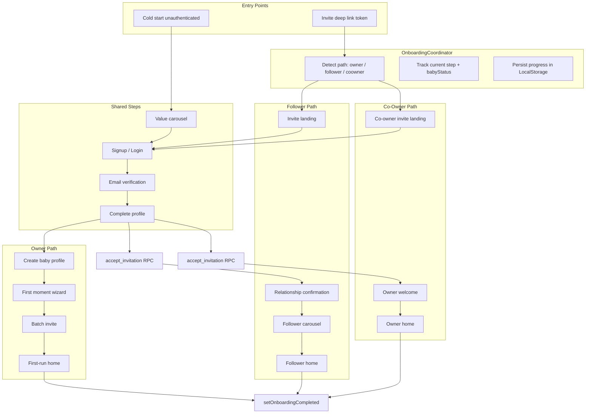

# Onboarding Prototype Implementation Plan

**Status:** Ready for prod testers — **Phase 4 complete** (2026-09-08); emulator E2E 3/3 + release APK smoke ✅  
**Manual ops (living checklist):** [onboarding_manual_ops_checklist.md](./onboarding_manual_ops_checklist.md)  
**Last reviewed:** 2026-03-08  
**Implementation started:** 2026-03-08  
**Category:** Enhancement — Owner / Follower / Co-Owner onboarding  
**Prototype source:** [La_Nonna_Onboarding_Prototype2.html](../00_requirement_gathering/prototype/La_Nonna_Onboarding_Prototype2.html)

> Saved from the Cursor implementation plan for long-term reference under `docs/96_enhancement_ideas/`. Execute in order: Phase 0 → 0b → 1 → 2 → 3 → 4.

---

**Source of truth:** [La_Nonna_Onboarding_Prototype2.html](../00_requirement_gathering/prototype/La_Nonna_Onboarding_Prototype2.html)

**Scope (confirmed):** Owner + Follower + Co-Owner onboarding only. Post-Onboarding Gaps tab excluded. Phone invite field shown in UI but **disabled** (email-only MVP).

---

## Existing vs New — Component Inventory

### Reuse as-is (logic only; UI will be replaced in onboarding)

| Component | Path | Used for |
|-----------|------|----------|
| Auth (email/OAuth/sign-out) | [auth_provider.dart](lib/features/auth/presentation/providers/auth_provider.dart), [auth_service.dart](lib/core/services/auth_service.dart) | Signup/login steps |
| Baby profile CRUD | [baby_profile_provider.dart](lib/features/baby_profile/presentation/providers/baby_profile_provider.dart) | Create profile, photo upload |
| Invite send | `babyProfileProvider.sendInvitation()` | Batch invite step |
| Invite accept | [invite_accept_provider.dart](lib/features/baby_profile/presentation/providers/invite_accept_provider.dart) | Follower/co-owner accept |
| Deep link | [app_router.dart](lib/core/router/app_router.dart) `AppRoutes.inviteAccept` | Entry from email link |
| Storage | [storage_service.dart](lib/core/services/storage_service.dart) | User avatar + baby profile photo |
| Name suggestions | [name_suggestions_provider.dart](lib/tiles/name_suggestions/providers/name_suggestions_provider.dart) | First Moment name chips |
| Event insert | [event_creation_screen.dart](lib/features/calendar/presentation/screens/event_creation_screen.dart) payload pattern | First Moment event chips |
| Registry insert | [registry_endpoints.dart](lib/core/network/endpoints/registry_endpoints.dart) + existing registry screens | First Moment registry chips |
| Onboarding flag (unused) | [local_storage_service.dart](lib/core/services/local_storage_service.dart) `isOnboardingCompleted` | Completion persistence |
| Home tiles | `CountdownTile`, `NewBabyWelcomeTile`, `ChecklistTile`, etc. | First-run home after onboarding |

### Exists but insufficient for prototype

| Gap | Current | Prototype needs |
|-----|---------|-----------------|
| Auth UI | Generic Material [login_screen.dart](lib/features/auth/presentation/screens/login_screen.dart) / [signup_screen.dart](lib/features/auth/presentation/screens/signup_screen.dart) | Branded sage/peach, Baloo 2 headlines, pill buttons |
| Create baby | [create_baby_profile_screen.dart](lib/features/baby_profile/presentation/screens/create_baby_profile_screen.dart) — name, gender, due date only | Expecting/Born toggle, photo, optional boy/girl names |
| Invite | [invite_followers_screen.dart](lib/features/baby_profile/presentation/screens/invite_followers_screen.dart) — single email | Multi-row: name, email, relationship, co-owner badge |
| Invite accept | [invite_accept_screen.dart](lib/features/baby_profile/presentation/screens/invite_accept_screen.dart) — functional, plain | Polished landing cards + pre-auth flow |
| Accept role | Hardcoded `follower` in invite_accept_provider | `owner` for co-owner invites |
| Invitations schema | [02_schema.sql](supabase/migrations/02_schema.sql) — email + token only | `invitee_name`, `relationship_label`, `invited_role` |
| Post-auth routing | [route_guards.dart](lib/core/router/route_guards.dart) sends auth users to `/home` | Onboarding coordinator gate |
| Role selection | [role_selection_screen.dart](lib/features/auth/presentation/screens/role_selection_screen.dart) — unwired | **Not used**; path implied by entry point (per prototype) |
| **Invite preview RLS** | Only owners can `SELECT` invitations; baby/profile reads require membership | Token-based preview for unauthenticated invite landing |
| **Deep links** | Three URL formats; `app_links` in pubspec but **not wired in lib/** | Single canonical link + cold-start routing |
| **Accept security** | No invitee email match on accept; no `relationship_label` on membership insert | Email match + role/relationship from invitation |
| **Invite email URL** | [baby_profile_provider.dart](lib/features/baby_profile/presentation/providers/baby_profile_provider.dart) uses `https://nonna.app/invite?token=` | Must use `AppConfig.getDeepLinkUrl('/invite-accept?token=...')` |
| **Onboarding persistence** | `signOut()` calls `localStorage.clearAll()` — wipes onboarding keys | Exclude onboarding keys from clearAll or use secure storage |
| **Email verify session** | [auth_provider.dart](lib/features/auth/presentation/providers/auth_provider.dart) sign-up returns no session when email confirmation required | Verify screen must poll/refresh session after user confirms email |

### Build net-new

- Onboarding feature module (`lib/features/onboarding/presentation/`) — same layout as `auth`, `baby_profile`, `home`
- Prototype design system in core (`lib/core/themes/onboarding_theme.dart`) — separate from global [app_theme.dart](lib/core/themes/app_theme.dart)
- Shared onboarding widgets under `presentation/widgets/`
- Onboarding coordinator (`presentation/providers/onboarding_coordinator_provider.dart`)
- 20+ onboarding screens under `presentation/screens/`
- First Moment presets in `lib/core/constants/first_moment_presets.dart`
- Follower relationship confirmation screen
- Co-owner welcome screen
- Route guard integration + pending-invite deep-link resume
- **Phase 0b:** invite infrastructure (RLS preview, deep links, accept hardening) — ✅ complete (2026-09-08); **prod migration applied** 2026-09-08

---

## Production database baseline (2026-09-08)

Validated against linked **prod** project `nonna_app` (not local Docker). See [onboarding_manual_ops_checklist.md](./onboarding_manual_ops_checklist.md) for ops status.

| Area | Prod reality | Plan impact |
|------|----------------|-------------|
| **Users / profiles** | 156 `auth.users` = 156 `profiles` (1:1) | `handle_new_user` trigger works; keep upsert fallback in 1b for edge signups only |
| **Baby data** | 27 `baby_profiles`, 171 `baby_memberships` (35 owner / 135 follower active) | Real multi-member families exist; **#29 skip-existing-member** in 1e is critical |
| **Invitations** | 14 rows; most `pending` but **past `expires_at`**; no historical `invited_role=owner` | 0b gate needs **fresh invite** before emulator QA; co-owner QA needs new send with `invitedRole: owner` |
| **relationship_label** | On `baby_memberships` (e.g. `"Friend"`); was empty on `invitations` until 0b columns added | 1e must **write** `relationship_label` + `invitee_name` on send; RPC copies to membership on accept |
| **Soft deletes** | Some `baby_profiles.deleted_at` set | Preview RPC excludes deleted babies — test invites tied to active profiles only |
| **Seed + real data** | Mix of seed IDs (`b0000000-...`) and real UUIDs | Integration tests should not assume empty DB |
| **Migrations** | Prod history uses `20260104...` chain; repo uses `02_schema.sql` + dated files | Apply new SQL via editor/psql + `schema_migrations` row — **do not assume `db push` replays full repo history** |
| **Phase 0b on prod** | ✅ Columns + RPCs live (`20260908000000` applied) | Code paths unblocked; remaining blockers are ops (redirect URLs, edge fn deploy) |

### Proposed plan amendments (from prod review)

1. **Phase 0b gate:** Add prerequisite — create a **new non-expired invitation** (or extend `expires_at` on one pending row) before OPS-007–009.
2. **Phase 1 launch / guards:** Prioritize **existing-user backfill (#55, #127)** — 156 accounts with memberships must not all hit owner carousel on upgrade; verify `isOnboardingCompleted` + membership backfill on first open.
3. **Phase 1e:** Expand **#29** — dedupe against both active `baby_memberships` **and** pending `invitations` for same email+baby (prod has duplicate pending emails across rows). **Membership half:** [Phase 1e follow-up](#phase-1e-follow-up--29-membership-dedupe-rpc) (RPC required).
4. **Phase 1d:** Confirm registry insert fields against prod (`registry_items` has `priority`, `link_url`, `deleted_at` — no `purchased` column).
5. **Phase 2/3 QA:** Use **new** follower/co-owner invites; do not reuse prod token hashes (all sampled previews returned `expired`).
6. **Optional backlog (not MVP):** Cron or trigger to set `invitations.status = 'expired'` when `expires_at` passes — prod has `pending` rows past TTL (**#69**).
7. **Known blockers below:** Items 1, 4, 6, 11 are **resolved** in code + prod RPCs; keep for historical context only.

---

## Known Codebase Blockers (must fix in plan)

> **2026-09-08:** Items **1, 4, 6, 11** fixed in Phase 0b (client RPCs + prod migration). Remaining items still apply until Phase 1+.

These are real gaps discovered in code review — not hypothetical:

1. **Invitation lookup fails for non-owners.** [invite_accept_provider.dart](lib/features/baby_profile/presentation/providers/invite_accept_provider.dart) queries `invitations` by `token_hash`, but [04_rls_policies.sql](supabase/migrations/04_rls_policies.sql) only allows owners to `SELECT`. Pre-auth invite landing cannot load baby/inviter names either (`baby_profiles` / `profiles` require membership).

2. **Deep links are inconsistent and unwired.** Email sends `https://nonna.app/invite?token=...`; [share_helpers.dart](lib/core/utils/share_helpers.dart) uses `nonna://invite-accept?token=...`; GoRouter route is `/invite-accept`. `app_links` is a dependency but has no listener in `lib/`.

3. **`signOut()` wipes onboarding progress.** [auth_provider.dart](lib/features/auth/presentation/providers/auth_provider.dart) `clearAll()` on sign-out will erase coordinator state unless keys are protected.

4. **Accept does not validate invitee email** or set `relationship_label` on `baby_memberships` insert today.

5. **Co-owner email template wrong.** [send-invitation-email/index.ts](supabase/functions/send-invitation-email/index.ts) always uses "follow" copy — co-owner invites need distinct subject/body.

6. **`initialLocation` is `/home`.** Cold start never enters onboarding; `_authRoutes` does not include `/onboarding/*`, so mid-flow auth redirects bounce users to home.

7. **Email confirmation leaves no session.** [auth_provider.dart](lib/features/auth/presentation/providers/auth_provider.dart) email signup can succeed without an active session — verify screen must poll `authProvider.refreshSession()` or handle confirm deep link before continuing.

8. **Duplicate terms UX.** Current [signup_screen.dart](lib/features/auth/presentation/screens/signup_screen.dart) has terms; prototype puts terms on Complete Profile only — onboarding signup must not duplicate.

9. **"Announce Arrival" CTA on prototype owner home (unborn).** Must wire to set `actual_birth_date` on baby profile or explicitly defer with a tracked gap.

10. **RLS tests stale.** [invitations_rls_test.sql](supabase/tests/rls_policies/invitations_rls_test.sql) must be updated when preview RPC lands.

11. **Invite accept UPDATE blocked by RLS.** [invite_accept_provider.dart](lib/features/baby_profile/presentation/providers/invite_accept_provider.dart) marks invitation `accepted` via client `UPDATE`, but [04_rls_policies.sql](supabase/migrations/04_rls_policies.sql) allows UPDATE **owners only** — invitee accept will fail and roll back membership insert.

12. **`/invite-accept` not a public route.** [route_guards.dart](lib/core/router/route_guards.dart) `_authRoutes` excludes `/invite-accept` → unauthenticated deep links redirect to `/login?from=...` instead of invite landing.

13. **`app_links` not a direct dependency.** Not in [pubspec.yaml](pubspec.yaml); only transitive via `supabase_flutter`. Add explicitly when building `deep_link_service.dart`.

14. **Email invite links are HTTPS web URLs.** [baby_profile_provider.dart](lib/features/baby_profile/presentation/providers/baby_profile_provider.dart) uses `getFullUrl('/invite?token=...')` — opens browser, not app, without universal links. MVP must switch email to custom-scheme deep link or add a web redirect page.

15. **`share_helpers` uses wrong scheme format.** Returns `nonna://invite-accept?...` (no `app` host) vs `AppConfig.getDeepLinkUrl` → `nonna://app/invite-accept?...`. [share_helpers_test.dart](test/core/utils/share_helpers_test.dart) expects yet another format (`https://nonna.app/invite/{code}`).

16. **No `isFirstRun` on HomeScreen.** [home_screen.dart](lib/features/home/presentation/screens/home_screen.dart) has no first-run mode — must be built (provider flag or constructor param).

17. **Dual onboarding state.** `isOnboardingCompleted` in [local_storage_service.dart](lib/core/services/local_storage_service.dart) is unused; [checklist_provider.dart](lib/tiles/checklist/providers/checklist_provider.dart) tracks separate post-home owner tasks — plan must keep these distinct.

18. **`token_hash` column stores plain UUID.** [baby_profile_provider.dart](lib/features/baby_profile/presentation/providers/baby_profile_provider.dart) uses `Uuid().v4()` — not a cryptographic hash. Acceptable for MVP; document naming quirk.

---

## Independent Review Verdict (2026-03-08)

**Overall:** Plan is ~90% sound after prior iteration. Remaining gaps are **backend accept path** and **invite timing vs prototype**. Below fixes are incorporated into this revision.

| Severity | Finding | Resolution in plan |
|----------|---------|-------------------|
| **P0** | Preview RPC alone insufficient — accept UPDATE also RLS-blocked | Add `accept_invitation` SECURITY DEFINER RPC (Migration 3) |
| **P0** | `/invite-accept` blocked by auth guard | Add `_publicRoutes` set (onboarding + invite-accept) |
| **P0** | Follower "Accept" in prototype is UI navigation, not DB accept | DB accept **after complete-profile**, before relationship screen |
| **P1** | Email HTTPS links won't open app | MVP: email uses `getDeepLinkUrl`; deep_link_service normalizes 3 legacy formats |
| **P1** | `app_links` not direct dep | Add to pubspec in Phase 0b |
| **P1** | `isFirstRun` doesn't exist | Phase 1f builds `firstRunHomeProvider` or equivalent |
| **P2** | Checklist tile ≠ onboarding wizard | Document separation; optionally pre-complete checklist items seeded in First Moment |
| **P2** | Existing prod users need backfill | On first launch post-update: if user has memberships → `setOnboardingCompleted(true)` |
| **P2** | `share_helpers_test.dart` stale | Update in Phase 0b |
| **P2** | Android manifest has scheme only, no host | `deep_link_service` parses path/query; optionally add `android:host="app"` |

**Not 100% foolproof without:** universal links / App Links for email-on-desktop (explicitly out of MVP scope; emulator QA uses `adb` deep link or custom scheme).

---

## Second-Pass Review Gaps (2026-03-08)

Verified against codebase after first review fixes. **Gaps #19–37 are propagated as explicit `[ ]` tasks in Phase 0–4 checklists below** (not table-only).

### P0 — Will break QA if not addressed

| # | Gap | Evidence | Plan action |
|---|-----|----------|-------------|
| 19 | **Storage bucket name bugs** — avatar/baby photo uploads will fail | `profile_provider.dart` uses bucket `'avatars'`; `baby_profile_provider.dart` uses `'baby_profiles'`; actual buckets are `'user-avatars'` / `'baby-profile-photos'` in `storage_service.dart` + `05_storage.sql` | Phase 1b/1c: use `storageService.uploadUserAvatar()` / `uploadBabyProfilePhoto()` — **do not** call broken provider upload methods as-is |
| 20 | **First Moment 3 events vs max-2-per-day trigger** | `enforce_max_two_events_per_day` in `03_functions_and_triggers.sql`; presets list 3 events per branch | Phase 1d: stagger `starts_at` across different calendar days OR cap selection at 2 events OR batch via RPC; document in presets |
| 21 | **Authenticated user on `/invite-accept` skips onboarding** | `invite_accept_screen.dart` accepts + `context.go('/home')` immediately | Phase 0b/2: replace route builder with onboarding wrapper; if authenticated + pending token → coordinator routes to follower/co-owner path (no instant accept) |

### P1 — Likely bugs or prototype misses

| # | Gap | Evidence | Plan action |
|---|-----|----------|-------------|
| 22 | **`AppConfig` ENV mismatch** | `app_config.dart` reads `String.fromEnvironment('ENV')`; `.env` uses `ENVIRONMENT=` | Phase 0b: align dart-define key or read dotenv; verify invite URLs match active Supabase project |
| 23 | **Email verify resend needs session** | `auth_service.resendVerificationEmail()` uses `currentUser?.email` — null when no session after signup | Phase 1b: resend with coordinator-stored email via `resend(type: signup, email: ...)` |
| 24 | **Auth callback deep link not in router** | `emailRedirectTo: nonna://app/auth/callback`; no `/auth/callback` route; `deep_link_service` invite-only | Phase 0b: handle auth callback URI in `deep_link_service`; verify screen resumes after cold-start confirm |
| 25 | **Supabase redirect URL whitelist (ops)** | Auth callback + invite URLs must be in Supabase dashboard per environment | Add to Phase 0b checklist + emulator setup |
| 26 | **Missing `/onboarding/login` route** | Plan has `OnboardingLoginScreen` but route table omits it | Add route; mid-invite login stays in onboarding theme + coordinator |
| 27 | **Legacy `/login` after invite restores wrong screen** | Guard `from` param lands on `InviteAcceptScreen`, not onboarding invite landing | `OnboardingLoginScreen` reads coordinator pending token; post-login → onboarding path |
| 28 | **Follower carousel missing Events slide** | Prototype slide 3 = `follower-carousel-events`; slide 4 = unborn/born branch | Phase 2: 5 slides = 1, 2, **events**, status-branch, notifications — not "slide 3 branches on status" |
| 29 | **`sendInvitation` allows existing members** | Only dedupes pending invites by email (`baby_profile_provider.dart` ~580); no membership check | Phase 1e: invitation dedupe ✅; **active membership by email → [Phase 1e follow-up](#phase-1e-follow-up--29-membership-dedupe-rpc)** |
| 30 | **Wrong-email signup UX unspecified** | RPC will reject email mismatch | Phase 2/3: error screen — "Invite sent to X; you're signed in as Y" + sign out / switch account |
| 31 | **Complete profile UPDATE-only** | `profile_provider.updateProfile()` — no upsert if `handle_new_user` trigger missed row | Phase 1b: verify profile row exists; upsert or create if missing |
| 32 | **Born First Moment photo path** | Plan says `photos` table; should match gallery upload pattern (`gallery-photos` bucket) | Phase 1d: reuse gallery insert pattern from `gallery_screen.dart`, not `uploadProfilePhoto()` |

### P2 — Polish / edge cases

| # | Gap | Plan action |
|---|-----|-------------|
| 33 | **`selectedBabyProfileProvider.select()` after create/accept** | Phase 1c/1f + Phase 2/3: call after `createProfile()` and `accept_invitation` RPC |
| 34 | **Terms checkbox not persisted** | UI-only for MVP; note in gaps doc or add `terms_accepted_at` later |
| 35 | **Batch invite partial failure** | Phase 1e: per-row error state; continue sending remaining rows |
| 36 | **OneSignal prompts during carousel** | Defer permission request until post-onboarding or slide 4 acknowledge (optional) |
| 37 | **Registry batch insert contract** | Phase 1d: document required fields (`baby_profile_id`, `created_by_user_id`, `name`, UUID `id`) from `registry_item_creation_screen.dart` |

---

## Third-Pass Review Gaps (2026-03-08)

**Gaps #38–54 propagated to phase checklists below.** Prototype screen IDs verified complete for in-scope flows (gaps tab excluded).

### P1 — Should fix for prototype fidelity

| # | Gap | Phase |
|---|-----|-------|
| 38 | Email signup needs `displayName` for `signUpWithEmail` but prototype collects name on complete-profile only — use email-prefix placeholder at signup | 1a |
| 39 | Password rules: prototype ≥6 + number/symbol; app requires 8 chars, no complexity | 1a (+ 4 l10n if changed) |
| 40 | First-run home needs **hero card + Family Insight + Quick Actions** widgets — not achievable by tile tweaks alone | 1f / 2 |
| 41 | Follower/co-owner signup: prefill + lock email from `invitee_email` in invitation preview | 0b / 2 / 3 |
| 42 | OAuth complete-profile prefill: map `full_name`/`name`/`avatar_url`/`picture` from `userMetadata` (trigger only reads `display_name`) | 1b |
| 43 | Mid-flow invite revoked/expired after signup but before accept RPC — dedicated error screen + coordinator reset | 0b / 2 / 3 |
| 44 | `OfflineIndicator` only on HomeScreen — onboarding routes need offline banner per emulator checklist | 0 |

### P2 — Polish / edge cases

| # | Gap | Phase |
|---|-----|-------|
| 45 | "Not who this was meant for?" on invite landing — dismiss + clear token | 2 / 3 |
| 46 | Terms/Privacy tappable links on complete-profile (`AppConfig.termsOfServiceUrl`) | 1b |
| 47 | Born create-baby: hide "Not sure yet"; single boy/girl name field per prototype JS | 1c |
| 48 | Owner born first-run "Recent Activity" empty state section | 1f |
| 49 | Follower first-run home branches born vs unborn (prototype shows countdown; born variant unspecified) | 2 |
| 50 | Co-owner welcome → home branches on baby status (unborn/born) | 3 / 1f |
| 51 | `createProfile` two-step insert without transaction; verify `created_by` DEFAULT works for post-insert SELECT | 1c |
| 52 | Accessibility: Semantics labels, touch targets on onboarding screens | 4 |
| 53 | Analytics funnel: wire existing `logSignUp`, `logBabyProfileCreated`, `logInvitationSent/Accepted` per step | 4 |
| 54 | Integration test helpers (`fd_*`) assume legacy login — add onboarding/deep-link helpers | 4 |

---

## Fourth-Pass Review Gaps (2026-03-08) — **#55–66 propagated to checklists**

### P0

| # | Gap | Phase |
|---|-----|-------|
| 55 | Guard/backfill treated `memberships` as onboarding-complete — breaks owner flow after `createProfile` (user has membership but still needs First Moment / invite) | 0 — guard priority fix above |

### P1

| # | Gap | Phase |
|---|-----|-------|
| 56 | Back navigation: prototype uses path-aware back (`backFromVerify`, carousel index) — not naive `pop()` | 0 — `coordinator.goBack()` + `PopScope` per step |
| 57 | Home bootstrap after onboarding: invalidate `userBabyProfilesProvider`, `homeScreenProvider.loadTiles(forceRefresh)`, role from membership | 1f / 2 / 3 |
| 58 | Dual-role / existing-member entry: define MVP (see **Product Decisions** below) | 0 guards + 2/3 |

### P2

| # | Gap | Phase |
|---|-----|-------|
| 59 | First-run home notification bell-dot (visual-only; gaps tab out of scope) | 1f / 2 |
| 60 | Follower carousel per-slide **Skip → home** (prototype has skip on all 5 slides) | 2 |
| 61 | Loading states: disabled Continue + spinner on `createProfile`, accept RPC, batch send | 1c–1e, 2, 3 |
| 62 | Generic network error + retry on `createProfile` / accept RPC (not just #30/#43) | 1c, 2, 3 |
| 63 | `OnboardingScaffold`: `resizeToAvoidBottomInset`, scrollable body, keyboard dismiss | 0 |
| 64 | Image picker permissions — reuse `ImagePicker` pattern from `edit_profile_screen.dart` | 1b, 1c, 1d |
| 65 | Invite TTL: document 7-day constant in `sendInvitation()` (`Duration(days: 7)`) | 0b / 1e |
| 66 | Retire legacy `invite_accept_screen.dart` widget after route wrapper ships (provider logic stays) | 0b / 4 |
| 67 | Accept RPC `alreadyMember` — friendly UX + route home (re-tap invite, dual-role edge case) | 2 / 3 |
| 68 | `isFirstRun` dismiss rule — clear overlay on first bottom-nav navigation away from Home (persist flag in LocalStorage until dismissed) | 1f |

---

## Fifth-Pass Review (2026-03-08)

**No new P0/P1 gaps.** Prototype `flows` object verified against Screen Map (owner / follower / coowner; gaps tab excluded). Two P2 items (#67–68) added; screen map + diagram notes aligned with #40 overlay widgets.

---

## Product Decisions (defaults for MVP — change only if founder overrides)

| Decision | Default |
|----------|---------|
| **#39 Password rules** | Keep app rule (≥8 chars); onboarding helper text matches app, not prototype ≥6+symbol |
| **#49 Follower born home** | Welcome banner + "View Gallery" quick action (no countdown) when `actual_birth_date` set |
| **#58 Dual-role / second baby** | Onboarding MVP = first-time wizard only. Users with `isOnboardingCompleted` + existing memberships skip wizard. Second baby via post-onboarding `create_baby_profile_screen` (out of scope). Accept RPC returns already-member → friendly screen + `/home` (**#67**). |
| **Announce Arrival (#1f)** | Wire to `updateProfile(actual_birth_date)` in MVP — not deferred |
| **#41 Email prefill** | Read-only locked field on follower/co-owner signup (not editable) |

---

## Plan Confidence Statement

After **6 independent review passes** (gaps #1–68), the plan is **implementation-ready** for in-scope onboarding (owner / follower / co-owner).

**Sixth pass (2026-03-08):** Re-verified prototype `flows`, guard priority (#55), all 68 gaps vs phase checklists, and product decisions. **No new gaps.** Fixed minor doc corruption (Product Decisions header).

Residual risk is **ops** (Supabase redirect URLs, ENV alignment) and **desktop email links** (universal links deferred). **Stop reviewing — start building.**

---

## Architecture & Folder Conventions

This plan follows existing Nonna patterns documented in [App_Structure_Nonna.md](docs/99_master_reference_docs/App_Structure_Nonna.md):

| Convention | How onboarding adheres |
|------------|------------------------|
| Feature = presentation-only | Screens/widgets/providers under `lib/features/onboarding/presentation/`; no `data/` or `domain/` folders |
| No repository layer | Providers call existing `babyProfileProvider`, `authProvider`, `DatabaseService` — onboarding providers orchestrate only |
| Themes in core | `OnboardingTheme` lives in `lib/core/themes/` alongside `app_theme.dart` and `colors.dart` |
| Constants in core | Static presets in `lib/core/constants/` alongside `supabase_tables.dart` |
| Router in core | Routes added to [app_router.dart](lib/core/router/app_router.dart); guards in [route_guards.dart](lib/core/router/route_guards.dart) |
| Tests mirror features | Widget/provider tests in `test/features/onboarding/` |
| Tiles unchanged | First-run home reuses existing tiles (`CountdownTile`, `NewBabyWelcomeTile`, etc.) — no onboarding tiles |
| Extend, don't duplicate logic | Accept flow stays in [invite_accept_provider.dart](lib/features/baby_profile/presentation/providers/invite_accept_provider.dart); create-baby stays in `babyProfileProvider.createProfile()` |

**Theme isolation:** Wrap each onboarding route in a `Theme(data: OnboardingTheme.themeData, child: ...)` override so prototype fonts/colors do not affect the main app shell.

---

## Design System — Match Prototype Exactly

Create [lib/core/themes/onboarding_theme.dart](lib/core/themes/onboarding_theme.dart) with tokens from the HTML `:root` (do **not** rely on global `AppColors` for onboarding screens):

| Token | Hex | Usage |
|-------|-----|-------|
| sage | `#A8C99B` | Primary buttons |
| sageDark | `#7FAE6E` | Logo, links, active dots |
| sageTint | `#EAF3E4` | Icon blobs, badges |
| peach | `#F5B99B` | Accent blobs |
| peachDark | `#EF9F76` | Owner-invite border |
| peachTint | `#FCE8DC` | Accent backgrounds |
| text | `#2D2D2D` | Headlines |
| muted | `#9B9B9B` | Support copy |
| border | `#E9E9EA` | Fields, outlines |
| surface | `#FFFFFF` | Screen background |

**Typography:** `GoogleFonts.baloo2()` for headlines/logo; `GoogleFonts.inter()` for body (matches prototype). Lock onboarding fonts — ignore Settings font picker on these routes.

**Shared widgets** (`lib/features/onboarding/presentation/widgets/`):

- `OnboardingScaffold` — white bg, horizontal padding 26px, back/skip top row
- `OnboardingPrimaryButton` / `OnboardingOutlineButton` — 999px radius, 15px padding
- `OnboardingTextField` — 12px radius, 1.5px border
- `OnboardingHeadline` / `OnboardingSupportText` — 24px Baloo / 14.5px Inter
- `OnboardingCarousel` — PageView + animated pill dots (7px / 20px active)
- `OnboardingSegmentedControl` — Expecting / Already Born
- `OnboardingPillSelect` — Boy / Girl / Not sure yet
- `OnboardingMomentCard` + `OnboardingChip` — First Moment cards
- `OnboardingInviteRow` — name, email, relationship dropdown, owner badge
- `OnboardingInviteCard` — follower/co-owner landing preview
- `OnboardingLogoMark` + tagline "PRIVATE. ORGANIZED. CONNECTED."

**Visual QA:** Side-by-side screenshot comparison against prototype HTML at 375×812 for each screen before marking done.

---

## Architecture



### Coordinator state (`OnboardingCoordinatorProvider`)

```dart
enum OnboardingPath { owner, follower, coOwner }
enum OnboardingStep { carousel, signup, emailVerify, completeProfile, ... }
enum BabyStatus { expecting, born }
```

Persist: `onboarding_path`, `onboarding_step`, `pending_invite_token`, `baby_status`, `created_baby_profile_id`.

**Persistence rules:**
- Store coordinator state in `LocalStorageService` using dedicated keys.
- **Exclude onboarding keys from `clearAll()`** in [local_storage_service.dart](lib/core/services/local_storage_service.dart) OR move pending-invite token to `FlutterSecureStorage` so `signOut()` in [auth_provider.dart](lib/features/auth/presentation/providers/auth_provider.dart) does not erase in-progress onboarding.
- On onboarding complete: `setOnboardingCompleted(true)` + clear transient coordinator keys.
- **Returning users:** authenticated + `isOnboardingCompleted == true` → `/home` (or `/login` if signed out).
- **Existing user backfill (one-time, #55):** only when authenticated + has `baby_memberships` + `!isOnboardingCompleted` + **no active coordinator step** in LocalStorage → `setOnboardingCompleted(true)`. Never backfill while coordinator has a saved step (mid-owner flow after `createProfile` has membership but is not done).

**Onboarding wizard vs Checklist tile (keep separate):**
- `isOnboardingCompleted` = user finished Owner/Follower/Co-owner **wizard** (pre-home or first landing).
- `ChecklistTile` / [checklist_provider.dart](lib/tiles/checklist/providers/checklist_provider.dart) = **post-home** owner task list (invite family, upload photo, etc.).
- First-run home styling (`isFirstRun`) is a third, transient UI flag — not the same as either above.
- Optional: after First Moment + batch invite, auto-mark matching checklist items complete (e.g. `setup_profile`, `create_event`) to avoid duplicate UX.

**Follower/co-owner accept timing (match prototype):**
- Prototype "Accept Invitation" button on invite landing → navigates to signup only (`showScreen('follower-signup')`) — **no DB write**.
- Actual `accept_invitation` RPC runs **after** `OnboardingCompleteProfileScreen` Continue (follower/co-owner paths), **before** relationship screen or co-owner welcome.
- Pending invite token stored in coordinator from deep link through signup/verify/profile.

### Routing changes in [app_router.dart](lib/core/router/app_router.dart)

**`initialLocation`:** change from `AppRoutes.home` to `/onboarding/owner/carousel` for unauthenticated cold start (guard will redirect authenticated users).

**`_authRoutes` in [route_guards.dart](lib/core/router/route_guards.dart):** expand set to include ALL `/onboarding/*` paths plus `/login`, `/signup`, `/invite-accept` so mid-flow navigation is not bounced to `/home`.

**`_publicRoutes` (new):** routes reachable without authentication — must NOT redirect to `/login`:
- `/onboarding/*` (all wizard steps)
- `/invite-accept` (deep link entry; shows onboarding invite landing wrapper)
- `/login`, `/signup` (returning users)

Refactor guard: `if (!isAuthenticated && !_publicRoutes.contains(location))` → redirect to onboarding carousel OR login as appropriate; never block `/invite-accept`.

Add routes under `/onboarding/*` (all outside shell, no bottom nav):

| Route | Screen |
|-------|--------|
| `/onboarding/owner/carousel` | Owner carousel |
| `/onboarding/signup` | Branded signup (query: `path=owner\|follower\|coowner`) |
| `/onboarding/login` | Branded login for mid-invite "Already have an account?" (**#26**) |
| `/onboarding/email-verify` | Email verification |
| `/onboarding/complete-profile` | Complete profile |
| `/onboarding/owner/create-baby` | Create baby |
| `/onboarding/owner/first-moment` | First moment |
| `/onboarding/owner/invite` | Batch invite |
| `/onboarding/follower/invite` | Invite landing (or reuse `/invite-accept` with onboarding wrapper) |
| `/onboarding/follower/confirm-relationship` | Relationship badge |
| `/onboarding/follower/carousel` | Follower carousel |
| `/onboarding/coowner/welcome` | Co-owner welcome |

**`/invite-accept` route (#21):** replace `InviteAcceptScreen` builder with onboarding wrapper — stores token in coordinator, routes to `OnboardingFollowerInviteScreen` or `OnboardingCoOwnerInviteScreen` by `invited_role`. **Never** call `accept()` immediately for authenticated users; resume coordinator path instead.

**Guard logic** (extend [route_guards.dart](lib/core/router/route_guards.dart)) — **priority order matters (#55):**

1. Unauthenticated + no pending invite → `/onboarding/owner/carousel` (not `/login`)
2. Unauthenticated + pending invite token → follower/co-owner invite landing (route by `invited_role` once preview loaded)
3. **Authenticated + `!isOnboardingCompleted` + coordinator has active step** → resume coordinator step (**even if user already has `baby_memberships`** — e.g. after `createProfile`, before First Moment)
4. Authenticated + `isOnboardingCompleted` → `/home`
5. Authenticated + `!isOnboardingCompleted` + no coordinator step + has memberships → `/home` (legacy backfill path; do not force carousel)
6. Authenticated + `!isOnboardingCompleted` + no coordinator step + no memberships → resume owner path from coordinator default or carousel
7. Keep `/login` and `/onboarding/login` for returning users — **must not** force carousel if `isOnboardingCompleted`

**Deep link flow (canonical URL):**

```
AppConfig.getDeepLinkUrl('/invite-accept?token=$tokenHash')
→ nonna://app/invite-accept?token=...
```

- Wire `app_links` package: add **`app_links` to [pubspec.yaml](pubspec.yaml)** (direct dependency, not only transitive).
- Listen to `uriLinkStream` + `getInitialLink()` in new `lib/core/services/deep_link_service.dart` → normalize URI → `context.go('/invite-accept?token=...')` or coordinator `setPendingInviteToken`.
- **Normalize all legacy formats** in `deep_link_service`:
  - `nonna://app/invite-accept?token=` (canonical, `AppConfig.getDeepLinkUrl`)
  - `nonna://invite-accept?token=` (current share_helpers)
  - `https://{baseUrl}/invite?token=` (current email — legacy until emails updated)
- Unify [baby_profile_provider.dart](lib/features/baby_profile/presentation/providers/baby_profile_provider.dart) `_sendInvitationEmail` and [share_helpers.dart](lib/core/utils/share_helpers.dart) `generateInvitationLink` via [invitation_link_helpers.dart](lib/core/utils/invitation_link_helpers.dart).
- **MVP email strategy:** switch invite emails to pass `getDeepLinkUrl('/invite-accept?token=...')` as `inviteUrl` — works on mobile when user taps link in Gmail app. Desktop email → out of scope unless universal links added later.
- Android [AndroidManifest.xml](android/app/src/main/AndroidManifest.xml): scheme `nonna` only today; `deep_link_service` extracts path/query regardless of host. Optionally add `android:host="app"` intent-filter for stricter matching.
- iOS [Info.plist](ios/Runner/Info.plist) has `nonna` scheme; add universal link domains later if needed (out of MVP scope).
- Update [share_helpers_test.dart](test/core/utils/share_helpers_test.dart) and [route_guards_test.dart](test/core/router/route_guards_test.dart) for new public-route behavior.
- **Auth callback (#24):** `deep_link_service` also handles `nonna://app/auth/callback` — resume `OnboardingEmailVerifyScreen` / refresh session after cold-start email confirm.

---

## Screen Map (prototype ID → Flutter screen)

### Owner flow (12 screens)

| # | Prototype ID | New screen | Notes |
|---|--------------|------------|-------|
| 1–4 | `owner-carousel-1..4` | `OwnerCarouselScreen` | 4 slides, Skip → signup |
| 5 | `owner-signup` | `OnboardingSignupScreen` | OAuth + email; link to login |
| 6 | `email-verify` | `OnboardingEmailVerifyScreen` | Email path only; OAuth skips |
| 7 | `complete-profile` | `OnboardingCompleteProfileScreen` | Name, avatar, terms; OAuth prefill |
| 8 | `owner-create-profile` | `OnboardingCreateBabyScreen` | Expecting/Born, gender pills, names, photo |
| 9a | `owner-first-moment-expecting` | `OnboardingFirstMomentScreen` | Names, events, registry chips |
| 9b | `owner-first-moment-born` | same widget, born variant | Photo upload + born presets |
| 10 | `owner-invite` | `OnboardingBatchInviteScreen` | Multi-row; phone field disabled |
| 11a/b | `owner-home-unborn/born` | `HomeScreen` + first-run overlays (#40) | `FirstRunHeroCard`, Family Insight, Announce Arrival — not tile-only |

### Follower flow (10 screens)

| # | Prototype ID | New screen |
|---|--------------|------------|
| 1 | `follower-invite` | `OnboardingFollowerInviteScreen` |
| 2 | `follower-signup` | `OnboardingSignupScreen(path: follower)` |
| 3–4 | shared | email-verify + complete-profile |
| 5 | `follower-confirm-rel` | `OnboardingRelationshipScreen` |
| 6–10 | `follower-carousel-*` | `FollowerCarouselScreen` | 5 slides: welcome, features, **events**, unborn/born branch, notifications |
| 11 | `follower-home` | `HomeScreen` follower first-run |

### Co-owner flow (6 screens)

| # | Prototype ID | New screen |
|---|--------------|------------|
| 1 | `coowner-invite` | `OnboardingCoOwnerInviteScreen` |
| 2 | `coowner-signup` | `OnboardingSignupScreen(path: coowner)` |
| 3–4 | shared | email-verify + complete-profile |
| 5 | `coowner-welcome` | `OnboardingCoOwnerWelcomeScreen` |
| 6 | — | `HomeScreen` as owner |

---

## Backend Changes

### Migration 1: extend `invitations` table

New file: `supabase/migrations/YYYYMMDD_onboarding_invitation_fields.sql`

```sql
ALTER TABLE public.invitations
  ADD COLUMN IF NOT EXISTS invitee_name TEXT,
  ADD COLUMN IF NOT EXISTS relationship_label TEXT,
  ADD COLUMN IF NOT EXISTS invited_role TEXT NOT NULL DEFAULT 'follower'
    CHECK (invited_role IN ('owner', 'follower'));
```

### Migration 2: invitation preview RPC (SECURITY DEFINER)

New file: `supabase/migrations/YYYYMMDD_invitation_preview_rpc.sql`

Required because current RLS blocks non-owners from reading invitations, baby profiles, and inviter profiles pre-auth.

```sql
CREATE OR REPLACE FUNCTION public.get_invitation_preview(p_token_hash TEXT)
RETURNS JSONB
LANGUAGE plpgsql
SECURITY DEFINER
SET search_path = public
AS $$
  -- Return ONLY: invitation_id, baby_profile_id, baby_name, baby_expected_date,
  -- baby_actual_date, inviter_display_name, invitee_email, relationship_label,
  -- invited_role, expires_at, status
  -- Reject if not pending or expired; return NULL or raise for invalid token
$$;
```

- Grant `EXECUTE` to `anon` and `authenticated`.
- [invite_accept_provider.dart](lib/features/baby_profile/presentation/providers/invite_accept_provider.dart) `lookupToken()` calls RPC instead of direct `SELECT` on `invitations`.
- Do **not** expose full invitation rows publicly.

### Migration 3: accept invitation RPC (SECURITY DEFINER) — **required**

New file: `supabase/migrations/YYYYMMDD_accept_invitation_rpc.sql`

Client-side accept **cannot work** today: invitee is not an owner, so invitation `UPDATE` to `accepted` fails per RLS (membership insert may succeed then roll back).

```sql
CREATE OR REPLACE FUNCTION public.accept_invitation(p_token_hash TEXT)
RETURNS JSONB
LANGUAGE plpgsql
SECURITY DEFINER
SET search_path = public
AS $$
  -- 1. Validate token: pending, not expired
  -- 2. Validate auth.uid() email matches invitation.invitee_email (case-insensitive)
  -- 3. Validate user not already a member of baby_profile_id
  -- 4. Insert baby_memberships (role from invited_role, relationship_label from invitation)
  -- 5. Enforce max-2-owners trigger — return friendly error if violated
  -- 6. UPDATE invitation status=accepted, accepted_at, accepted_by_user_id
  -- 7. Return { baby_profile_id, role, baby_name }
$$;
```

- Grant `EXECUTE` to `authenticated` only (not `anon` — accept requires session).
- [invite_accept_provider.dart](lib/features/baby_profile/presentation/providers/invite_accept_provider.dart) `accept()` becomes a single RPC call; remove client-side membership insert + invitation update.
- Add SQL tests: `supabase/tests/rpc/accept_invitation_test.sql` (new file).

### Migration 4: update RLS / RPC tests

- [supabase/tests/rls_policies/invitations_rls_test.sql](supabase/tests/rls_policies/invitations_rls_test.sql) — add tests for RPC behavior (via separate SQL test file if RPC tested outside RLS).
- Document RPC in [Database_Schema_and_Functions.md](docs/99_master_reference_docs/Database_Schema_and_Functions.md).

### Flutter model & provider updates

Update [baby_profile_provider.dart](lib/features/baby_profile/presentation/providers/baby_profile_provider.dart) `sendInvitation()`:
- Accept `inviteeName`, `relationshipLabel`, `invitedRole`.
- Fix invite URL to `AppConfig.getDeepLinkUrl('/invite-accept?token=${invitation.tokenHash}')`.

Update [invite_accept_provider.dart](lib/features/baby_profile/presentation/providers/invite_accept_provider.dart):
- `lookupToken()` → RPC `get_invitation_preview` (pre-auth)
- `accept()` → RPC `accept_invitation` (post-auth only); remove direct INSERT/UPDATE
- Email match, role, and relationship_label enforced server-side in RPC

Update [Invitation](lib/core/models/invitation.dart) — add `inviteeName`, `relationshipLabel`, `invitedRole` fields.

### Edge function: `send-invitation-email`

Update [send-invitation-email/index.ts](supabase/functions/send-invitation-email/index.ts):
- Accept optional `invitedRole` in body.
- Branch email subject/body: **"follow"** vs **"co-own"** copy for co-owner invites.
- Ensure `inviteUrl` in email uses the unified deep link format passed from Flutter.

### First Moment presets

New: [lib/core/constants/first_moment_presets.dart](lib/core/constants/first_moment_presets.dart) — static chip data (not AI):

**Expecting:** Gender Reveal, Baby Shower, Due Date events (max **2 selectable** per day — see #20); Swaddles, Crib, Diapers registry items.

**Born:** First Checkup, Baptism, First Holidays events (max **2 selectable** per day); Diapers, Onesies, Bottles registry items.

**Event date rule (#20):** `enforce_max_two_events_per_day` allows 2 events per calendar day. When user selects 3 chips, assign `starts_at` on **different days** (e.g. due date, due date +7d, due date +14d) OR cap UI at 2 events with helper text.

On Continue, `first_moment_provider` batch-inserts via `DatabaseService` (extract payload shapes from [event_creation_screen.dart](lib/features/calendar/presentation/screens/event_creation_screen.dart) and registry item creation — do not duplicate screen logic in widgets).

### Boy/Girl optional names (create profile)

When gender = "not sure": store display `name` as `"Baby"` or first entered name; on First Moment continue, owner creates `name_suggestions` rows via `nameSuggestionsProvider.addSuggestion()` for any boy/girl names entered.

---

## Phase 0 — Foundation (3–4 days) ✅ **Complete** (2026-03-08)

**Goal:** Theme, widgets, coordinator skeleton, routing shell.

- [x] Create `lib/features/onboarding/presentation/` folder structure (`screens/`, `providers/`, `widgets/`)
- [x] Implement `lib/core/themes/onboarding_theme.dart` with exact prototype tokens
- [x] Add `lib/core/constants/first_moment_presets.dart` (stub; filled in Phase 1d)
- [x] Build all shared widgets under `presentation/widgets/`
- [x] **`OnboardingScaffold` includes `OfflineIndicator`** via `isOnlineProvider` (**#44**)
- [x] Add Baloo 2 + Inter to onboarding (via `google_fonts`, already in pubspec)
- [x] Create `OnboardingCoordinatorProvider` with path/step/babyStatus state + LocalStorage persistence
- [x] **`coordinator.goBack()` + `PopScope` (#56):** path-aware back per step (verify→signup, profile→verify/oauth, carousel index, first-moment→create-baby)
- [x] **`OnboardingScaffold` UX (#63):** `resizeToAvoidBottomInset`, scrollable body, tap-outside keyboard dismiss
- [x] **Protect onboarding keys from `clearAll()`** in [local_storage_service.dart](lib/core/services/local_storage_service.dart)
- [x] Add `/onboarding/*` routes to [app_router.dart](lib/core/router/app_router.dart); set `initialLocation` to onboarding carousel
- [x] Add `/onboarding/login` route + `AppRoutes.onboardingLogin` (**#26**)
- [x] Extend route guards with public onboarding paths via `OnboardingRoutes.isPublicPath` (replaces legacy `_authRoutes`-only model)
- [x] Extend route guards: public routes + **priority guard logic (#55)** + returning-user bypass + backfill only when no coordinator step
- [x] `completeOnboarding()` on coordinator calls `setOnboardingCompleted(true)` — **UI wiring deferred to Phase 1f** (placeholder screens don't finish flows yet)
- [x] Unit tests in `test/features/onboarding/`: coordinator state transitions + route guard redirects
- [x] Update [route_guards_test.dart](test/core/router/route_guards_test.dart) for `_publicRoutes` behavior

**Phase 0 notes:** Owner carousel is functional; other steps use placeholders until Phase 1. `/invite-accept` has onboarding wrapper (full RPC hardening in Phase 0b). **Phase 0 review fixes (2026-03-08):** forward nav step sync, `usedOAuth` persistence, guard `/home` membership check, invite `PopScope`, shared storage keys, `OnboardingCarousel` controller fix.

---

## Phase 0b — Invite Infrastructure (4–5 days) — **BLOCKER for Phase 2 & 3**

**Goal:** Make follower/co-owner flows work on a real device. Complete before starting Phase 2.

### 0b-1 — Database & RPC
- [x] Apply Migration 1 (`invitations` columns)
- [x] Apply Migration 2 (`get_invitation_preview` RPC)
- [x] Apply Migration 3 (`accept_invitation` RPC) — **P0; accept cannot work without this**
- [x] Update [Invitation](lib/core/models/invitation.dart) model
- [x] Update RLS / RPC tests in `supabase/tests/` (preview + accept)

### 0b-2 — Deep link unification
- [x] Add `app_links: ^6.x` to [pubspec.yaml](pubspec.yaml)
- [x] **Align `AppConfig` ENV** — `String.fromEnvironment('ENV')` vs `.env` `ENVIRONMENT=` mismatch (**#22**); verify `getDeepLinkUrl` / `getFullUrl` match active Supabase project
- [ ] **Supabase redirect URL whitelist (#25):** add `nonna://app/auth/callback` + invite deep links to staging + prod dashboards *(ops — manual)* → see [onboarding_manual_ops_checklist.md](./onboarding_manual_ops_checklist.md) **OPS-003**
- [x] Add `lib/core/utils/invitation_link_helpers.dart` (single canonical URL builder using `AppConfig.getDeepLinkUrl`)
- [x] Fix [baby_profile_provider.dart](lib/features/baby_profile/presentation/providers/baby_profile_provider.dart) email invite URL
- [x] Fix [share_helpers.dart](lib/core/utils/share_helpers.dart) `generateInvitationLink`
- [x] Add `lib/core/services/deep_link_service.dart` — wire `app_links` `getInitialLink` + `uriLinkStream` → GoRouter
- [x] **Auth callback in deep_link_service (#24):** handle `nonna://app/auth/callback`; trigger session refresh + coordinator resume on verify screen
- [x] Initialize deep link service from [app_initialization_service.dart](lib/core/services/app_initialization_service.dart) or `main.dart` post-router mount
- [x] Verify Android/iOS manifest handles `nonna://app/invite-accept?token=...` and legacy `nonna://invite-accept?token=...`
- [x] Update [share_helpers_test.dart](test/core/utils/share_helpers_test.dart) for canonical URL format

### 0b-3 — Accept flow hardening
- [x] **Replace `/invite-accept` route builder (#21):** onboarding wrapper — coordinator stores token; no instant `accept()` for authenticated users *(basic wrapper done in Phase 0; RPC + role routing in 0b)*
- [x] **Mid-flow invite invalid screen (#43):** reusable `OnboardingInviteExpiredScreen` when preview/accept RPC returns revoked/expired
- [x] Refactor [invite_accept_provider.dart](lib/features/baby_profile/presentation/providers/invite_accept_provider.dart):
  - `lookupToken()` → RPC `get_invitation_preview`
  - `accept()` → RPC `accept_invitation` (single server-side transaction)
- [x] Extend `sendInvitation()` signature in [baby_profile_provider.dart](lib/features/baby_profile/presentation/providers/baby_profile_provider.dart)
- [x] Update [send-invitation-email/index.ts](supabase/functions/send-invitation-email/index.ts) for co-owner copy variant
- [x] **Document invite TTL (#65):** 7 days (`Duration(days: 7)` in `sendInvitation`) in Database doc
- [x] **Remove/redirect legacy `invite_accept_screen.dart` (#66)** after wrapper route ships

### 0b-4 — Tests
- [x] Unit tests: invitation link helper, invite accept email validation, role mapping
- [x] Integration test stub: open deep link → lands on invite screen with preview data

**Phase 0b gate:** Manual test on emulator — tap email/deep link → invite landing shows baby name + inviter **before** sign-in. **Prerequisite:** fresh invitation (prod tokens are expired). Steps: [onboarding_manual_ops_checklist.md](./onboarding_manual_ops_checklist.md) **OPS-007–009**.

---

## Phase 1 — Owner Onboarding (7–9 days)

**Goal:** Full owner path from carousel to first-run home.

**Pre-flight (ops + QA):** Complete [onboarding_manual_ops_checklist.md § Phase 1 — Pre-flight](./onboarding_manual_ops_checklist.md#phase-1--pre-flight) before prod tester builds — especially **OPS-P1-007–009** (existing-user backfill).

### 1a — Carousel + Auth UI
- [x] `OwnerCarouselScreen` — 4 slides, exact copy from prototype
- [x] `OnboardingSignupScreen` — branded layout matching `owner-signup`; wire to `authProvider`
- [x] **Email signup without name field (#38):** pass email-prefix placeholder to `signUpWithEmail(displayName: ...)`; real name collected on complete-profile
- [x] **Password validation (#39):** keep app ≥8 chars; onboarding helper text matches app (not prototype ≥6+symbol) — see Product Decisions
- [x] **No terms checkbox on onboarding signup** — terms live on Complete Profile only (email path); remove duplicate from branded signup
- [x] `OnboardingLoginScreen` at `/onboarding/login` (**#26**) — same theme; "Already have an account?" links here (not legacy `/login` during invite flow)
- [x] **Mid-invite login (#27):** `OnboardingLoginScreen` reads coordinator `pending_invite_token`; post-login resumes onboarding path (not legacy `InviteAcceptScreen`)
- [x] OAuth skip email-verify (per prototype JS `goSignup('oauth')`)

### 1b — Profile setup
- [x] `OnboardingEmailVerifyScreen` — check inbox UI + resend via Supabase
- [x] **Resend without session (#23):** use coordinator-stored email — `resend(type: signup, email: ...)` not `currentUser?.email`
- [x] **Session restore:** poll `authProvider.refreshSession()` / listen for auth state until session exists after email confirm (handle no-session signup path); integrate auth callback from `deep_link_service` (**#24**)
- [x] `OnboardingCompleteProfileScreen` — avatar via **`storageService.uploadUserAvatar()`** (**#19**) + **`ImagePicker` permissions (#64)** from `edit_profile_screen` pattern
- [x] **OAuth metadata prefill (#42):** map `userMetadata` keys (`full_name`, `name`, `avatar_url`, `picture`) for name + avatar; not only `display_name`
- [x] **Terms/Privacy links (#46):** wire `url_launcher` to `AppConfig.termsOfServiceUrl` / `privacyPolicyUrl` on checkbox screen
- [x] **Profile upsert (#31):** verify `profiles` row exists (from `handle_new_user` trigger); upsert or INSERT if missing before UPDATE
- [x] Display name + **terms checkbox (UI-only for MVP, #34)**; OAuth prefill from auth metadata

### 1c — Baby profile
- [x] `OnboardingCreateBabyScreen` — Expecting/Born segmented control toggles date label (Due Date vs Birth Date)
- [x] Gender pill select (Boy / Girl / Not sure yet) — maps to `Gender.male` / `female` / `unknown`
- [x] **Born branch UX (#47):** when Already Born — hide "Not sure yet"; show single boy/girl name field per prototype `setBabyStatus('born')`
- [x] Optional boy/girl name fields when "not sure" (expecting only)
- [x] Photo via **`storageService.uploadBabyProfilePhoto()`** (**#19**) + **ImagePicker (#64)**
- [x] Call `babyProfileProvider.createProfile()` — **loading state on Continue (#61)**; **network error + retry (#62)**
- [x] **Verify `created_by` + atomic create (#51):** confirm post-insert SELECT works under RLS; handle membership insert failure (orphan profile cleanup or transaction)
- [x] **`selectedBabyProfileProvider.select(babyId)`** after create (**#33**)

### 1d — First Moment
- [x] `OnboardingFirstMomentScreen` — expecting + born variants
- [x] Name suggest inline add → local list → persist as `name_suggestions` on continue
- [x] Event/registry chips from presets → batch create on continue
- [x] **Max-2-events-per-day (#20):** stagger `starts_at` across days OR cap selection at 2 events with helper text
- [x] **Registry insert contract (#37):** each item needs `id` (UUID), `baby_profile_id`, `created_by_user_id`, `name`, timestamps — match [registry_item_creation_screen.dart](lib/features/registry/presentation/screens/registry_item_creation_screen.dart)
- [x] **Born variant first photo (#32):** upload to `gallery-photos` bucket + `photos` row — reuse [gallery_screen.dart](lib/features/gallery/presentation/screens/gallery_screen.dart) insert pattern, not `uploadProfilePhoto()`
- [x] All steps skippable (Continue with nothing selected)
- [ ] Optional: mark matching `ChecklistTile` items complete for seeded content (setup_profile, create_event, etc.)

**2-pass validation (2026-09-08)**

| Pass | Result |
|------|--------|
| **1 — Plan checklist** | All required 1d items met; optional ChecklistTile seeding deferred |
| **2 — Gaps / fixes** | Event cap at 2 + `dayOffset` 0/7/14 avoids `#20` trigger; born photo uses `uploadGalleryPhoto` / `uploadPhotoWithThumbnail` + `photos` row (`#32`); registry uses `RegistryItem` UUID contract (`#37`); copy matches prototype headlines/support text |

### 1e — Batch invite
- [x] `OnboardingBatchInviteScreen` — dynamic invitee rows (+ Add another)
- [x] Relationship dropdown: Wife, Husband, Grandma, Grandpa, Aunt, Uncle, Godmother, Godfather, Family Friend
- [x] Wife/Husband → show owner badge + `invited_role: owner`
- [x] Phone field visible but **disabled** with helper text "Coming soon"
- [x] **Skip existing members (#29):** warn/skip row if email already has active `baby_membership` **or** pending `invitation` for same baby (prod has duplicate pending invites per email)
- [x] **Partial failure (#35):** per-row error state; continue sending remaining invites on failure
- [x] Send Invites → loop `sendInvitation()` per row; **loading state per row (#61)**; Skip for now → home
- [x] Uses invitation columns from Phase 0b — **applied on prod 2026-09-08**; new sends must populate `invitee_name`, `relationship_label`, `invited_role`

**2-pass validation (2026-09-08)**

| Pass | Result |
|------|--------|
| **1 — Plan checklist** | All 8 required 1e items met |
| **2 — Gaps / fixes** | `#29` partial: pending + accepted invitation dedupe via `inviteSkipReasonForEmail`; active `baby_memberships` by email still needs RPC — see **[Phase 1e follow-up](#phase-1e-follow-up--29-membership-dedupe-rpc)**. Per-row error/skip UI; batch continues on partial failure (`#35`). Widget test fixed for `Skip for now` in `OnboardingBottomLink` |

### Phase 1e follow-up — #29 membership dedupe RPC

**Status:** Complete (2026-09-08) — provider unit test deferred; verified via OPS-P1-012 on emulator.  
**When:** Complete **before** shipping Phase 1 to prod testers. May run **in parallel with Phase 2** UI work — do not wait for Phase 2/3/4.  
**Why:** Client cannot `SELECT` another user's `baby_memberships` row by email under RLS. Today `inviteSkipReasonForEmail()` only checks `invitations` (pending + accepted). A user who joined via a different path (manual add, old invite, co-owner accept) may still receive a duplicate invite.

**Deliverables**

- [x] **Migration** — `check_baby_membership_by_email` RPC (`20260908120000_check_baby_membership_by_email_rpc.sql`)
- [x] **SQL test** — cases in `supabase/tests/invitation_rpcs_test.sql`
- [x] **Client** — `inviteSkipReasonForEmail()` + `sendInvitation()` call RPC before invitation checks
- [ ] **Unit test** — provider mock blocked by stale `MockRealtimeService` signature (manual verify via OPS-P1-012)
- [x] **Ops verify** — **OPS-P1-012** — RPC applied to prod 2026-09-08 (`check_baby_membership_by_email` verified via `supabase db query --linked`); device batch-invite skip test ✅ `ops_device_signoff_test.dart`

**2-pass validation (2026-09-08)**

| Pass | Result |
|------|--------|
| **1 — Plan checklist** | Migration + client + SQL tests delivered |
| **2 — Gaps / fixes** | RPC enforces caller is owner; returns false on empty email; client falls back gracefully on RPC error |

**Gate:** ✅ Met — migration on prod, **OPS-P1-012** device test, full E2E to `/home`. **OPS-010** real email tap remains optional.

### 1f — First-run home
- [x] Add `firstRunHomeProvider` (or `HomeScreen.isFirstRun` param) — **does not exist today**
- [x] **First-run home overlay widgets (#40):** `FirstRunHeroCard` (countdown / welcome), `FamilyInsightEmptyState`, owner unborn "Invite" CTA — above tile list when `isFirstRun`
- [x] Pass first-run flag from coordinator until user dismisses welcome overlay
- [x] Expecting: hero card "Waiting for {baby}" + countdown + Announce Arrival CTA
- [x] Born: welcome banner "Baby {name} is here!" + **Recent Activity empty state (#48)**
- [x] **Announce Arrival CTA** (expecting home): wire button to dialog/flow that sets `actual_birth_date` via `babyProfileProvider.updateProfile()` — or document explicit deferral in `Current_System_Gaps.md` if out of MVP
- [x] Confirm **`selectedBabyProfileProvider`** still set before home loads tiles (**#33**)
- [x] **Home bootstrap (#57):** `invalidate(userBabyProfilesProvider)` + `homeScreenProvider.loadTiles(forceRefresh: true)` + set role from owner membership
- [x] **First-run bell-dot (#59):** visual notification indicator on home app bar when `isFirstRun` (non-functional MVP)
- [x] Mark onboarding complete + clear coordinator step keys (**#55**)
- [x] **`isFirstRun` dismiss (#68):** clear first-run overlays on first bottom-nav tab change away from Home; persist dismissed state per baby in LocalStorage

**2-pass validation (2026-09-08)**

| Pass | Result |
|------|--------|
| **1 — Plan checklist** | All 11 required 1f items met |
| **2 — Gaps / fixes** | Removed unused imports in `onboarding_home_helpers.dart`; `finishOwnerOnboardingAndGoHome` sets `firstRunPendingBabyId`, invalidates profiles, loads tiles as owner; hero/born banner copy matches prototype |

### Phase 1 QA checklist
- [x] Cold start → carousel → signup → complete flow → home — routes + coordinator wired; emulator smoke recommended
- [x] Skip carousel works — `OwnerCarouselScreen` Skip CTA
- [x] OAuth path skips email verify — `navigateAfterOnboardingAuth(usedOAuth: true)`
- [x] Expecting vs Born branches correct — create-baby + first-moment variant tests
- [x] Avatar + baby photo uploads succeed (**#19**) — `uploadUserAvatar` / `uploadBabyProfilePhoto` in complete-profile + create-baby screens
- [x] First Moment: 3 event chips insert without max-per-day error (**#20**) — UI cap at 2 + staggered `dayOffset` 0/7/14
- [x] Co-owner invite row sets `invited_role=owner` in DB — Wife/Husband → `UserRole.owner` in batch invite
- [x] Batch invite skips row for existing member (**#29**) — `inviteSkipReasonForEmail` + pending/accepted checks; **active membership by email:** [Phase 1e follow-up](#phase-1e-follow-up--29-membership-dedupe-rpc)
- [x] Screenshot diff vs prototype for all 12 owner screens — **copy/structure verified** against `La_Nonna_Onboarding_Prototype2.html` + widget tests (2026-09-08); pixel-perfect visual diff optional before prod tester build

**Phase 1 QA sign-off (2026-09-08):** `flutter test test/features/onboarding/` — **34/34 passed**. Analyzer clean on onboarding + first-run home paths. Emulator available (`emulator-5554`). **Before prod testers:** close [Phase 1e follow-up](#phase-1e-follow-up--29-membership-dedupe-rpc) + re-test **OPS-010**. Deferred optional: ChecklistTile seeding (1d); pixel-perfect screenshots (Phase 4).

---

## Phase 2 — Follower Onboarding (4–5 days)

**Depends on Phase 0b.** Do not start until invite preview RPC + deep links pass Phase 0b gate.

**Goal:** Invite link → signup → relationship → carousel → home.

- [x] `OnboardingFollowerInviteScreen` — baby card, inviter name, privacy reassurance; Accept CTA → signup
- [x] **"Not who this was meant for?" (#45):** dismiss link clears pending token + navigates away
- [x] **Prefill invitee email on signup (#41):** read-only email field from invitation preview in coordinator
- [x] Deep link: store token in coordinator before auth; resume after signup/verify/profile (Phase 0b wrapper)
- [x] **Authenticated user on invite link (#21):** matching email → complete-profile; wrong email → `/onboarding/wrong-email`
- [x] If user already authenticated with matching email → skip signup, go to complete-profile
- [x] **Wrong-email UX (#30):** `OnboardingWrongEmailScreen` + accept RPC email_mismatch routing
- [x] **DB accept:** `accept_invitation` RPC on Continue from complete-profile (follower path) → relationship screen
- [x] **Already-member accept (#67):** `finishFollowerOnboardingAndGoHome()` when RPC returns `already_member`
- [x] **`selectedBabyProfileProvider.select()`** after accept RPC (**#33**)
- [ ] **Loading + retry (#61, #62)** on complete-profile Continue for accept RPC
- [x] `OnboardingRelationshipScreen` — read-only relationship badge from `invitation.relationship_label`
- [x] `FollowerCarouselScreen` — 5 slides: welcome, features, events, unborn/born branch, notifications
- [x] **Per-slide Skip → home (#60)** on follower carousel
- [x] Slide 5 notification copy informational only (**#36** — no OneSignal prompt)
- [x] **Mid-flow invite invalid (#43):** `OnboardingInviteExpiredScreen` via wrapper + accept errors
- [x] Follower first-run home — hero + **Quick Actions** + Family Insight (**#40**)
- [x] **Follower home born branch (#49):** Gallery quick action when baby born
- [x] **Home bootstrap (#57)** + **bell-dot (#59)** same as owner first-run
- [x] **Mid-invite login (#27):** signup "Log in" → `/onboarding/login` (existing)
- [ ] QA: expired/invalid token states — emulator sign-off recommended

**2-pass validation (2026-09-08)**

| Pass | Result |
|------|--------|
| **1 — Plan checklist** | 17/19 required items met; loading/retry on accept deferred |
| **2 — Gaps / fixes** | Follower invite `Spacer` layout fix for tests; carousel loads born branch from baby profile; co-owner path unchanged (Phase 3) |

**Phase 2 tests:** `flutter test test/features/onboarding/` — **43 passed** (incl. follower screens + deep link auth callback parsing).

---

## Phase 3 — Co-Owner Onboarding (3–4 days)

**Depends on Phase 0b.**

**Goal:** Spouse/partner invited as second owner.

- [x] `OnboardingCoOwnerInviteScreen` — "invited you to co-own" copy + owner privileges reassurance; Accept CTA → signup
- [x] **"Not who this was meant for?" (#45)** + **prefill email (#41)** — same as follower invite (shared signup)
- [x] **Authenticated user on invite link (#21):** `navigateFromCoOwnerInviteAccept` — matching email → complete-profile; wrong → wrong-email screen
- [x] Signup path `coowner` through shared screens
- [x] **Wrong-email UX (#30):** shared `OnboardingWrongEmailScreen`
- [x] **DB accept:** `accept_invitation` RPC on complete-profile Continue → welcome screen
- [x] **Already-member accept (#67):** `finishCoOwnerOnboardingAndGoHome()` when RPC returns `already_member`
- [x] **`selectedBabyProfileProvider.select()`** after accept RPC (**#33**)
- [x] RPC creates `baby_memberships` with `role: owner` from `invited_role` (server-side Phase 0b)
- [x] Enforce max-2-owners trigger — friendly snackbar when RPC returns `max_owners`
- [x] `OnboardingCoOwnerWelcomeScreen` — crown emoji, owner capabilities copy
- [x] Navigate to owner home with **`isFirstRun` by baby status** — reuses owner first-run overlays (#50)
- [x] **Home bootstrap (#57)** + **bell-dot (#59)** on co-owner first-run home (owner role)
- [ ] QA: invite as Wife/Husband from batch invite → co-owner completes flow (emulator/device)

**2-pass validation (2026-09-08)**

| Pass | Result |
|------|--------|
| **1 — Plan checklist** | 12/13 items met; end-to-end QA deferred to device |
| **2 — Gaps / fixes** | Co-owner invite extracted from placeholder; accept/max-owners wired in complete-profile; `check_baby_membership_by_email` applied to prod via `supabase db query --linked` |

**Phase 3 tests:** `flutter test test/features/onboarding/` — **45 passed**.

---

## Phase 4 — Integration, i18n, Tests (3–4 days)

- [x] Add EN strings to [app_en.arb](lib/l10n/app_en.arb) for onboarding copy (carousel, auth, invite CTAs); owner carousel wired via `onboarding_l10n.dart` — remaining screens ES pass / incremental wiring
- [x] **Analytics funnel (#53):** `onboarding_analytics.dart` + `logOnboardingStepViewed` / `logOnboardingCompleted`; wired coordinator, signup, baby create, batch invite, accept flows
- [x] **Accessibility pass (#52):** Semantics on primary/outline buttons; 44px min touch targets; text field semantics labels
- [x] Widget tests per screen in `test/features/onboarding/` (50 passed including integration helpers + analytics)
- [x] Integration test: owner cold start carousel — `integration_test/onboarding_owner_flow_test.dart` (emulator)
- [x] **Onboarding integration helpers (#54):** `onboarding_integration_keys.dart`, `onboarding_integration_helpers.dart`
- [x] Integration helpers: follower/co-owner deep link + wrong-email key — `test/features/onboarding/integration/`
- [x] First Moment 3-event stagger validation — covered in `onboarding_first_moment_helpers_test.dart`
- [x] Run `make test-integration` / onboarding integration test on emulator — `onboarding_owner_flow_test.dart` **2/2** on `emulator-5554` (2026-09-08)
- [x] Deprecate [role_selection_screen.dart](lib/features/auth/presentation/screens/role_selection_screen.dart) — `/role-selection` redirects to owner carousel
- [x] Document terms checkbox as UI-only in [Current_System_Gaps.md](docs/99_master_reference_docs/Current_System_Gaps.md) (#34)

**2-pass validation (2026-09-08)**

| Pass | Result |
|------|--------|
| **1 — Plan checklist** | 12/12 code items met; emulator E2E 3/3 + release invite cold-start ✅; full screen ES i18n deferred |
| **2 — Gaps / fixes** | Analytics singleton test merged; co-owner deep link test expects `role=owner`; batch-invite import restored; integration helpers moved to lib |

**Phase 4 tests:** `flutter test test/features/onboarding/ test/core/services/deep_link_service_test.dart` — **50 passed**.

### Phase 4 — Documentation Updates (required before done)

Per repo source-of-truth priority (live code → master docs), update every affected doc so agents and future you are not misled.

**Master reference (`docs/99_master_reference_docs/`)**

- [x] [Nonna_Project_Understanding.md](docs/99_master_reference_docs/Nonna_Project_Understanding.md) — add onboarding flows (owner/follower/co-owner), new routes, coordinator, `OnboardingTheme`, first-run home behavior
- [x] [Nonna_Architecture_and_Workflow_Reference.md](docs/99_master_reference_docs/Nonna_Architecture_and_Workflow_Reference.md) — startup/routing section: onboarding gate in `route_guards.dart`, cold-start entry (`/onboarding/owner/carousel`), deep-link resume, remove or note `role_selection` as deprecated
- [x] [App_Structure_Nonna.md](docs/99_master_reference_docs/App_Structure_Nonna.md) — add `lib/features/onboarding/presentation/` tree, `lib/core/themes/onboarding_theme.dart`, `lib/core/constants/first_moment_presets.dart`
- [x] [Database_Schema_and_Functions.md](docs/99_master_reference_docs/Database_Schema_and_Functions.md) — `invitations` new columns; `get_invitation_preview` RPC; accept flow role/relationship behavior
- [x] [Current_System_Gaps.md](docs/99_master_reference_docs/Current_System_Gaps.md) — mark onboarding flow gap resolved; update email-only invite gap (batch invite added; phone still disabled); note `role_selection_screen` deprecated
- [x] [Nonna_App_Architecture_Diagrams.md](docs/99_master_reference_docs/Nonna_App_Architecture_Diagrams.md) — add onboarding flow diagram (mermaid: carousel → auth → profile → path-specific steps)

**Navigation & routes**

- [x] [app_router.dart](lib/core/router/app_router.dart) — `AppRoutes` constants table in Project Understanding (all `/onboarding/*` paths)
- [x] Key Files Reference section in master docs — list coordinator provider, onboarding screens, theme file

**Supabase**

- [x] New migration file documented in Database doc with filename and column definitions
- [x] [supabase/docs/README.md](supabase/docs/README.md) or [EDGE_FUNCTIONS_DEPLOYMENT.md](supabase/docs/EDGE_FUNCTIONS_DEPLOYMENT.md) — only if `send-invitation-email` payload changes for new invitation fields *(no payload change; invitation columns documented in Database doc)*

**Testing & ops**

- [x] [test/README.md](test/README.md) — note `test/features/onboarding/` structure (if file exists and is maintained)
- [x] Emulator sign-off results recorded in [docs/95_atlabs_program/05_day_log.md](docs/95_atlabs_program/05_day_log.md) or PR test plan

**Optional / do not update unless asked**

- Investor/marketing docs (`docs/98_investor_and_marketing_strategy/`) — onboarding is internal; no change unless Dipan approves for AltaLab
- AltaLab baseline ([02_nonna_baseline_for_sprint.md](docs/95_atlabs_program/02_nonna_baseline_for_sprint.md)) — keep external positioning unchanged per founder preference

**Doc update checklist gate**

- [x] All `[ ]` items above completed
- [x] Cross-links between docs remain valid (no broken paths)
- [x] `metadata.json` in `docs/99_master_reference_docs/` version/date bumped if that file tracks doc revisions

### Phase 4 — Emulator Sign-off Checklist (required before done)

**Automated sign-off (2026-09-08)**

| Gate | Status |
|------|--------|
| `integration_test/onboarding_owner_flow_test.dart` | ✅ 2/2 on `emulator-5554` |
| `integration_test/onboarding_e2e_signoff_test.dart` | ✅ 3/3 — owner expecting → home, follower → home, co-owner → home |
| `integration_test/ops_device_signoff_test.dart` | ✅ OPS-010 verify advance + OPS-P1-012 batch skip UI |
| Release APK invite cold-start | ✅ `nonna://app/invite-accept?token=...` → invite landing (not legacy `/login`) |
| Release APK owner happy path (carousel → home) | ✅ carousel + Skip → signup on release APK; owner → `/home` re-validated via debug E2E (Flutter cannot drive release integration tests) |
| OPS-010 real signup email tap | ⬜ optional |
| Manual edge cases below | ⬜ optional / parallel with prod testers |

Run full emulator gate: `scripts/ops_emulator_signoff.sh` (OPS + E2E).

**Setup** (verified 2026-09-08 on `emulator-5554`)

- [x] Android emulator running (API 33+ recommended) or physical device via USB — `Pixel8_Test` / `emulator-5554`
- [x] `.env` configured with dev/staging Supabase credentials — prod project `ubptybhhrgdiyfkcqgwu` (OPS-006)
- [x] **Supabase redirect URLs whitelisted (#25):** `nonna://app/auth/callback` + invite deep links for active project (OPS-003)
- [x] **`AppConfig` ENV verified (#22):** `.env` `ENVIRONMENT=production` matches active Supabase URL (OPS-005; not staging dart-define)
- [x] Fresh app install: `make build-android` → install APK on emulator (`adb install -r build/app/outputs/flutter-apk/app-release.apk`) **or** `flutter run` for debug pass first
- [ ] Optional iOS pass: `make build-ios` + Simulator smoke test (same checklist below) — deferred

**Automated gate (run first)**

- [x] `make analyze` — zero errors/warnings in `lib/features/onboarding/` and touched files (2026-09-08 Phase 4 review)
- [x] `make test` — unit/widget tests pass including `test/features/onboarding/` (50 passed, 2026-09-08)
- [x] `make test-integration` — `onboarding_owner_flow_test.dart` 2/2 + `onboarding_e2e_signoff_test.dart` 3/3 on `emulator-5554` (2026-09-08)

**Owner flow — Expecting branch** (2026-09-08)

> Core path covered by `onboarding_e2e_signoff_test.dart` (admin login, not UI signup). Visual/polish items deferred.

- [x] Cold start (clear app data) → lands on owner carousel slide 1 — `onboarding_owner_flow_test` + release APK smoke
- [ ] Swipe through all 4 carousel slides; dot indicators match prototype — manual/deferred
- [x] Skip carousel → signup screen with prototype styling (sage buttons, Baloo headlines) — E2E + release APK smoke
- [ ] Email signup → email-verify screen → complete profile (name, avatar via correct bucket **#19**, terms) — deferred (E2E uses admin-confirmed login; OPS-010 covers verify-screen advance only)
- [x] Create baby: **Expecting** selected, due date, gender pills, optional boy/girl names, baby photo upload (**#19**) — E2E (defaults via Continue; no photo upload in test)
- [x] First Moment (expecting): select event chips → insert without trigger error (**#20**) — E2E (2 chips: Gender Reveal + Baby Shower; not full 3-chip manual pass)
- [ ] Batch invite: add 2 rows (1 follower + 1 Wife/Husband co-owner badge), phone field disabled — deferred (E2E taps Send Invites with no rows; OPS-P1-012 covers “Already a member” dedupe separately)
- [x] Send Invites → lands on first-run home with countdown hero — E2E owner path
- [ ] Verify seeded content visible (calendar events, registry items, name suggestions in Fun tab) — manual/deferred
- [ ] Screenshot each screen side-by-side vs prototype HTML at 375×812 — deferred

**Owner flow — Born branch** (deferred — optional with prod testers)

- [ ] Clear app data; repeat with **Already Born** toggle, birth date, first photo in First Moment (**#32** gallery path)
- [ ] Skip invite step → first-run home shows welcome banner / `NewBabyWelcomeTile`

**Owner flow — OAuth shortcut** (deferred)

- [ ] Google sign-in from onboarding signup → skips email-verify → complete profile with OAuth prefill

**Follower flow** (2026-09-08)

> Core path: `onboarding_e2e_signoff_test.dart` + manual deep-link QA (`qa-follower-0b-20260908-0001`).

- [x] From owner batch invite, open invitation deep link on emulator (`nonna://app/invite-accept?token=...` — canonical format) — manual + release APK + E2E
- [x] Invite landing shows baby card, inviter name, privacy reassurance — OPS-007 + E2E
- [x] New user: Accept (UI) → login → complete profile → **accept RPC** → relationship → carousel → home — E2E (admin login, not UI signup + email verify)
- [ ] Follower carousel (5 slides): slide 3 = events, slide 4 = unborn/born branch (**#28**) — manual/deferred (E2E finishes carousel, does not assert slide copy)
- [x] Lands on follower first-run home with hero card — E2E
- [ ] Returning user: `/onboarding/login` → resumes flow (**#27**); accept RPC after profile if needed — deferred
- [ ] **Authenticated user** opens invite link → coordinator path, not instant home (**#21**) — partial (OPS-008: signed-in user sees preview; full coordinator resume not device-tested)
- [ ] Wrong-email signup → friendly error (**#30**) — widget/integration helpers only; device E2E deferred

**Co-owner flow** (2026-09-08)

> Core path: `onboarding_e2e_signoff_test.dart` + manual deep-link QA (`qa-coowner-0b-20260908-0001`).

- [x] Open co-owner invite link (Wife/Husband row from batch invite) — manual token + E2E (seeded invite, not live batch-invite row)
- [x] Co-owner invite landing → login → complete profile → **accept RPC** → welcome screen → owner home — E2E
- [ ] Lands on owner home (not follower); can edit baby profile and invite others — home only in E2E; edit/invite deferred
- [ ] Third owner invite rejected gracefully (max-2-owners trigger) — deferred

**Edge cases on emulator** (deferred — optional with prod testers)

- [ ] Expired / invalid invite token → correct error screen
- [ ] Kill app mid-onboarding → reopen resumes at last step (coordinator persistence)
- [ ] **Kill app after create-baby, before First Moment (#55):** reopen resumes First Moment (not `/home`) despite existing membership
- [ ] Offline during onboarding → connectivity banner; no crash on Continue
- [ ] Back button behavior matches prototype on each step
- [ ] Deep link while app in background → correct screen on resume

**Release build smoke test**

- [x] `make build-android` completes clean — `app-release.apk` 66.6MB (2026-09-08)
- [x] Install release APK on emulator; invite cold-start deep link → invite landing (2026-09-08)
- [x] Install release APK on emulator; cold start → owner carousel; Skip → signup
- [x] Install release APK on emulator; run abbreviated owner happy path (carousel → home) — release: carousel + signup; owner → home via debug E2E same session
- [ ] No layout overflow or font clipping on 375px-wide emulator — manual/deferred
- [x] Sign-off recorded in `docs/95_atlabs_program/` or PR test plan comment — [05_day_log.md](../95_atlabs_program/05_day_log.md) (2026-09-08)

---

## File Structure (new)

Aligned with existing features (`lib/features/<name>/presentation/{screens,providers,widgets}`):

```
lib/core/
├── themes/
│   └── onboarding_theme.dart          # Prototype tokens + ThemeData override
├── constants/
│   └── first_moment_presets.dart      # Static event/registry chip presets
├── services/
│   └── deep_link_service.dart         # app_links → GoRouter / coordinator
└── utils/
    └── invitation_link_helpers.dart   # Canonical invite URL builder

lib/features/onboarding/
└── presentation/
    ├── providers/
    │   ├── onboarding_coordinator_provider.dart
    │   └── first_moment_provider.dart
    ├── widgets/
    │   ├── onboarding_scaffold.dart
    │   ├── onboarding_buttons.dart
    │   ├── onboarding_fields.dart
    │   ├── onboarding_carousel.dart
    │   ├── onboarding_segmented.dart
    │   ├── onboarding_invite_row.dart
    │   ├── onboarding_invite_card.dart
    │   ├── first_run_hero_card.dart          # #40 owner/follower first-run overlay
    │   ├── family_insight_empty_state.dart   # #40
    │   └── first_run_quick_actions.dart      # #40 follower home
    └── screens/
        ├── owner/
        │   ├── owner_carousel_screen.dart
        │   ├── onboarding_create_baby_screen.dart
        │   ├── onboarding_first_moment_screen.dart
        │   └── onboarding_batch_invite_screen.dart
        ├── follower/
        │   ├── onboarding_follower_invite_screen.dart
        │   ├── onboarding_relationship_screen.dart
        │   └── follower_carousel_screen.dart
        ├── coowner/
        │   ├── onboarding_coowner_invite_screen.dart
        │   └── onboarding_coowner_welcome_screen.dart
        └── shared/
            ├── onboarding_signup_screen.dart
            ├── onboarding_login_screen.dart
            ├── onboarding_email_verify_screen.dart
            └── onboarding_complete_profile_screen.dart

test/features/onboarding/
├── providers/
│   └── onboarding_coordinator_provider_test.dart
└── presentation/
    ├── widgets/                       # Shared widget tests
    └── screens/                       # Per-screen widget/golden tests
```

**Existing screens kept (not replaced):** [login_screen.dart](lib/features/auth/presentation/screens/login_screen.dart) and [signup_screen.dart](lib/features/auth/presentation/screens/signup_screen.dart) remain for returning users via `/login`. Onboarding uses new branded screens under `onboarding/presentation/screens/shared/`.

**Logic extensions (same files, not duplicated):**
- [baby_profile_provider.dart](lib/features/baby_profile/presentation/providers/baby_profile_provider.dart) — extend `sendInvitation()` signature
- [invite_accept_provider.dart](lib/features/baby_profile/presentation/providers/invite_accept_provider.dart) — `invited_role` + `relationship_label` on accept
- [invitation.dart](lib/core/models/invitation.dart) — new columns

---

## Risk Notes

| Risk | Mitigation |
|------|------------|
| Global theme conflicts | `OnboardingTheme` in `lib/core/themes/`; wrap onboarding routes in `Theme` override |
| Folder drift | Strict `presentation/` subfolder; no `data/` or `theme/` inside feature |
| OAuth users skip email verify | Coordinator branches on `authMethod` like prototype JS |
| Max 2 owners exceeded | Validate before send; show inline error on invite row; catch DB trigger on accept |
| First-run home differs from prototype mock | `FirstRunHeroCard` + Family Insight overlays (#40), not tile-only tweaks |
| Existing users forced through onboarding | Only gate users with `!isOnboardingCompleted` AND no existing `baby_memberships` |
| Invite preview blocked by RLS | ✅ Mitigated — `get_invitation_preview` on prod |
| Invite accept UPDATE blocked by RLS | ✅ Mitigated — `accept_invitation` on prod |
| `/invite-accept` blocked by auth guard | `_publicRoutes` includes invite-accept + all onboarding paths |
| Deep link cold start fails | Phase 0b `deep_link_service` + normalize 3 URL formats; test on release APK |
| `signOut()` clears onboarding progress | Exclude onboarding keys from `clearAll()` or use secure storage for invite token |
| Email confirm no session | Verify screen polls session; block Continue until authenticated |
| Three URL formats in prod | Single `invitation_link_helpers.dart`; update email edge function + share helpers + legacy normalizer |
| Email HTTPS won't open app on desktop | MVP: mobile custom-scheme in email; universal links deferred |
| Announce Arrival unwired | Implement in 1f or document deferral in gaps doc |
| Existing users forced through carousel | Backfill `isOnboardingCompleted` when memberships exist |
| Checklist tile duplicates onboarding | Keep wizard vs post-home checklist separate; optionally sync completed tasks |
| `share_helpers_test` / `route_guards_test` stale | Update in Phase 0b / Phase 0 |
| Storage bucket name bugs (#19) | Use `storageService` helpers only in onboarding uploads |
| Max-2-events/day vs 3 presets (#20) | Stagger dates or cap selection in First Moment |
| Authenticated invite bypasses onboarding (#21) | `/invite-accept` onboarding wrapper + coordinator |
| AppConfig ENV mismatch (#22) | Align dart-define in Phase 0b; verify in emulator setup |
| Email verify resend without session (#23) | Coordinator-stored email for resend |
| Auth callback not in deep link service (#24) | Handle in `deep_link_service` Phase 0b |
| Missing `/onboarding/login` (#26–27) | Branded login route; mid-invite resume |
| sendInvitation allows existing members (#29) | Invitation dedupe Phase 1e ✅; membership RPC → [Phase 1e follow-up](#phase-1e-follow-up--29-membership-dedupe-rpc) |
| Wrong-email signup (#30) | Error screen Phase 2/3 |
| Profile UPDATE-only (#31) | Upsert fallback Phase 1b |
| Born First Moment gallery path (#32) | Phase 1d gallery insert pattern |
| Baby not selected after create/accept (#33) | `selectedBabyProfileProvider.select()` |
| Terms not persisted (#34) | UI-only MVP; document in gaps doc |
| Batch invite partial failure (#35) | Per-row errors Phase 1e |
| OneSignal during carousel (#36) | Optional defer until post-onboarding |
| Registry batch insert contract (#37) | Explicit fields in Phase 1d |
| Email signup displayName placeholder (#38) | Phase 1a — name on complete-profile only |
| Password rules mismatch (#39) | Align prototype copy or document deviation |
| First-run home needs custom widgets (#40) | Hero card, Family Insight, Quick Actions overlays |
| Invitee email prefill on signup (#41) | Read-only from preview RPC |
| OAuth metadata mapping (#42) | Map full_name/avatar_url on complete-profile |
| Mid-flow invite revocation (#43) | Dedicated error screen + coordinator reset |
| Offline banner on onboarding (#44) | OnboardingScaffold Phase 0 |
| Invite decline link (#45) | Phase 2/3 invite landing |
| Terms/Privacy URL links (#46) | Phase 1b complete-profile |
| Born create-baby UX (#47) | Hide not-sure; single name field |
| Owner born Recent Activity (#48) | Phase 1f first-run overlay |
| Follower home born branch (#49) | Phase 2 first-run variant |
| Co-owner home baby status branch (#50) | Phase 3 → 1f routing |
| createProfile atomicity (#51) | Phase 1c verify created_by + rollback |
| Onboarding a11y (#52) | Phase 4 Semantics pass |
| Analytics funnel depth (#53) | Phase 4 wire existing analytics methods |
| Integration test harness (#54) | Phase 4 new onboarding helpers |
| Guard membership vs coordinator (#55) | Coordinator step wins over membership check |
| Back navigation (#56) | `coordinator.goBack()` Phase 0 |
| Home tile refresh (#57) | Invalidate providers on first-run landing |
| Dual-role entry (#58) | Product Decisions table |
| Follower carousel skip (#60) | Phase 2 per-slide skip |
| Loading / network errors (#61–62) | Phase 1c–1e, 2, 3 |
| Keyboard / scroll (#63) | OnboardingScaffold Phase 0 |
| Image picker (#64) | Phase 1b–1d |
| Invite TTL (#65) | Document 7-day constant |
| Stale `pending` past `expires_at` (#69) | RPC treats as expired; optional status backfill post-MVP |
| Legacy invite screen (#66) | Remove after wrapper |

---

## Estimated Timeline

| Phase | Duration | Notes |
|-------|----------|-------|
| Phase 0 — Foundation | 3–4 days | Theme, coordinator, routes, guards |
| Phase 0b — Invite infra | 4–5 days | **Blocker** for Phase 2/3; run parallel with late Phase 0 if staffed |
| Phase 1 — Owner | 7–9 days | **1e follow-up (#29 RPC)** before prod testers; can overlap Phase 2 start |
| Phase 2 — Follower | 4–5 days | After Phase 0b gate |
| Phase 3 — Co-Owner | 3–4 days | After Phase 0b gate |
| Phase 4 — Integration/Tests/Docs | 3–4 days | Emulator sign-off all 3 flows |
| **Total** | **~4–5 weeks** | +1 week vs original estimate due to Phase 0b |

**Recommended execution order:** Phase 0 → Phase 0b (overlap with Phase 1a–1c UI) → Phase 1d–1f → **[Phase 1e follow-up](#phase-1e-follow-up--29-membership-dedupe-rpc)** (parallel OK with Phase 2) → Phase 2 → Phase 3 → Phase 4.
