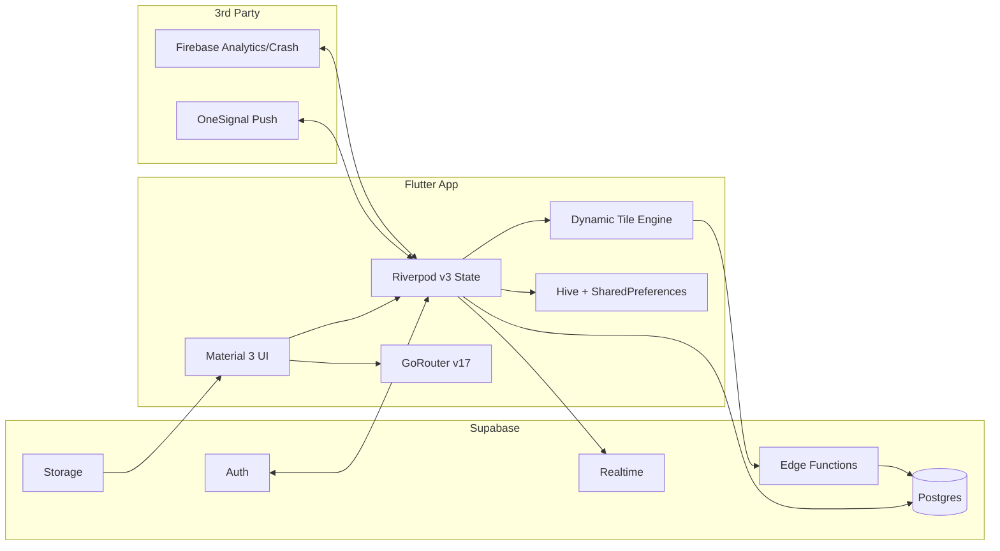
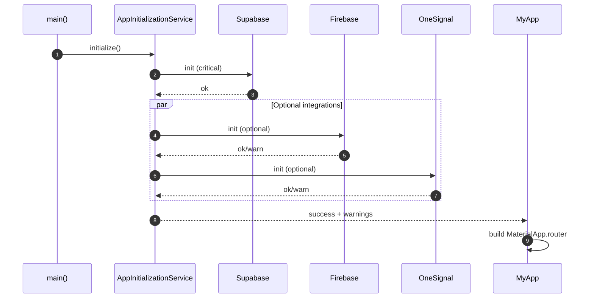
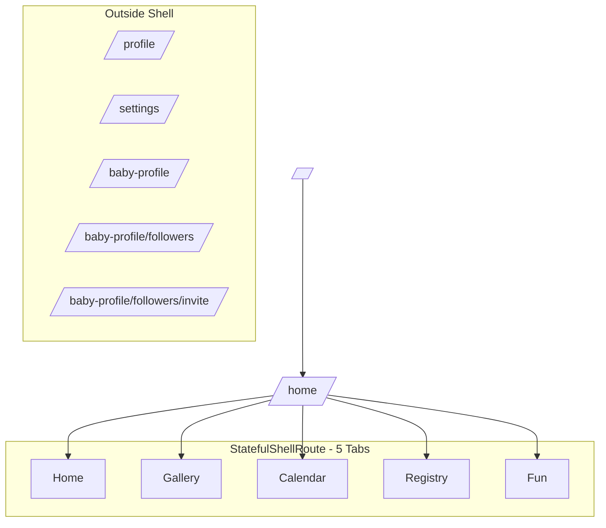
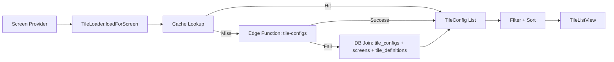
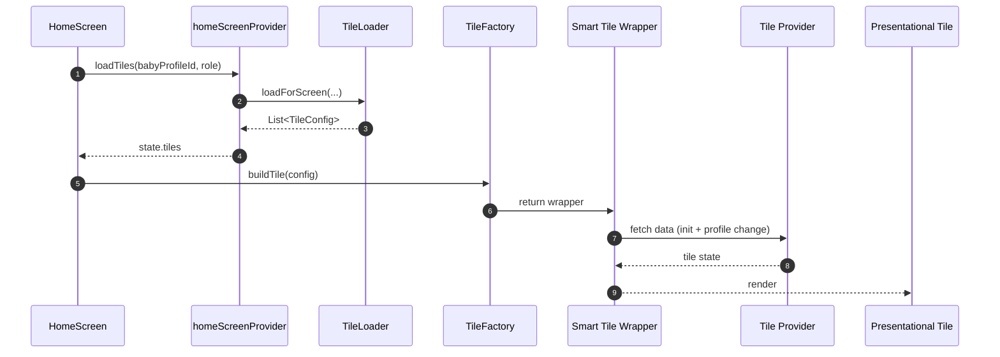
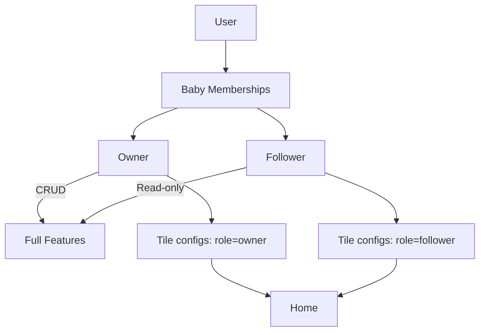
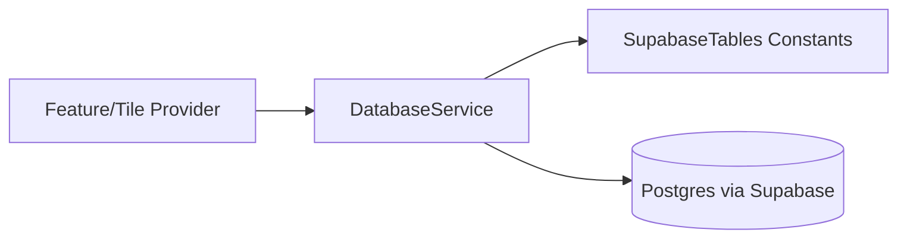

# Nonna App - Architecture Diagrams

These Mermaid diagrams give a visual map of how the Nonna app works, from startup to tiles, routing, and data flow.

---

## 1) System Overview

---

## 2) Startup and Initialization Flow

---

## 3) Navigation Shell (Tabs + Fullscreen Routes)

---

## 4) Tile Engine Pipeline (Edge-First with DB Fallback)

---

## 5) Tile Rendering and Smart Wrapper Pattern

---

## 6) Role Model and Visibility

---

## 7) Data Access Rule (Service + Constants)

