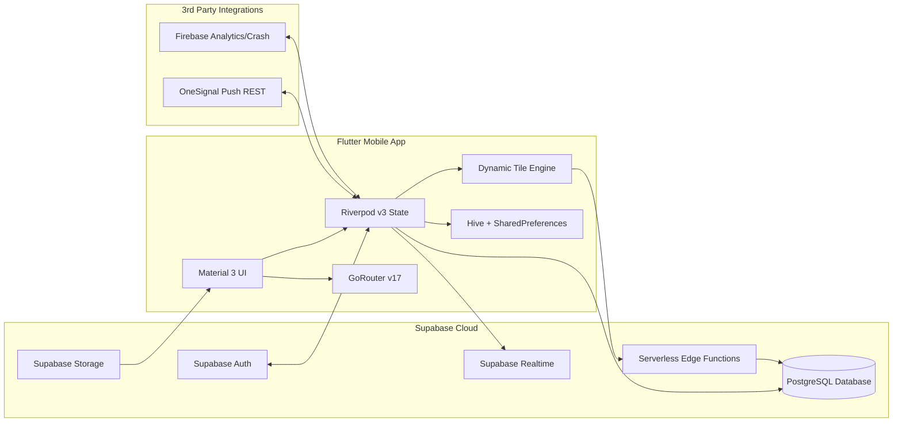
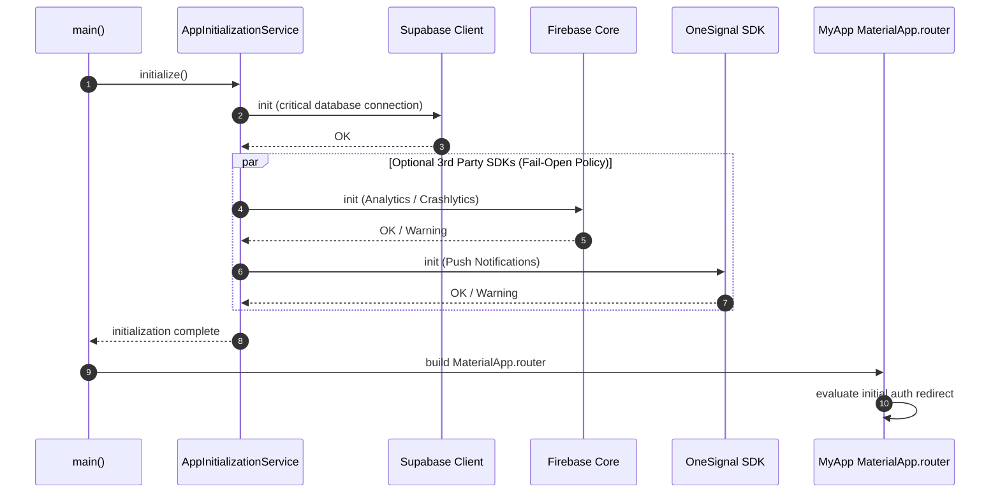
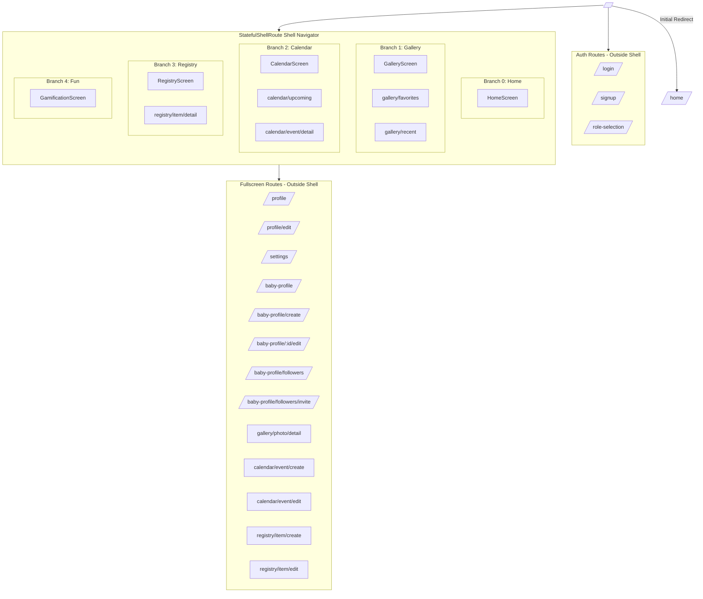
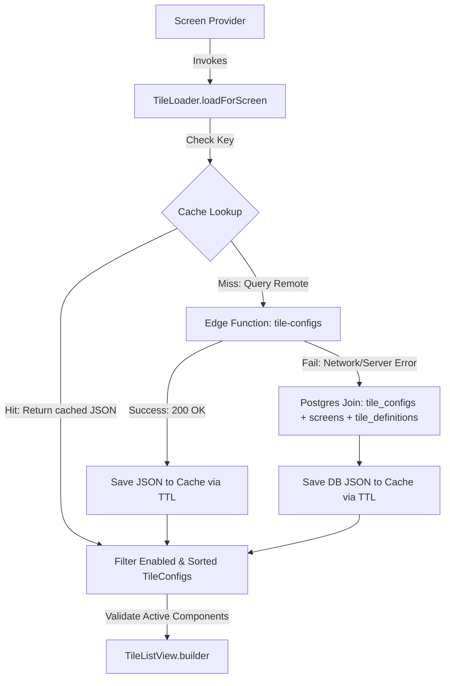
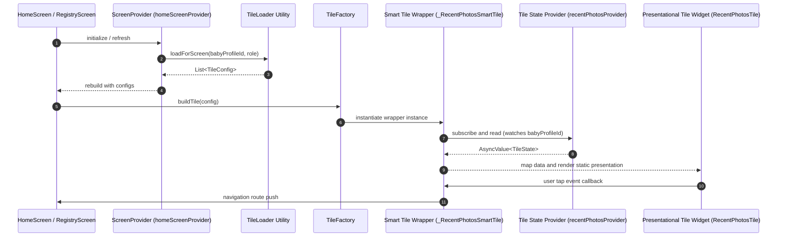
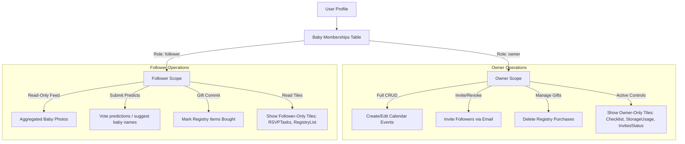
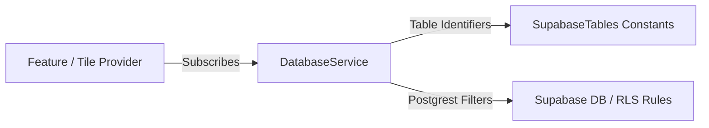

# Nonna App - Architecture Diagrams

**Document Version**: 3.0
**Last Updated**: May 25, 2026
**Location**: `docs/99_master_reference_docs/Nonna_App_Architecture_Diagrams.md`
**Status**: Living Document - Fully updated with GoRouter v17 and decoupled TileLoader pipeline

These Mermaid diagrams provide a comprehensive visual map of the Nonna app's systems, from startup sequences to tab routing, dynamic tile rendering, role authorization, and data flow.

---

## 1) High-Level System Overview

The Nonna application combines a modern Flutter mobile front-end (Material 3, Riverpod v3 state management, Hive caching) with a Supabase PostgreSQL backend, leveraging serverless Edge Functions for background tasks and push notification multi-plexing.

---

## 2) Startup and Initialization Sequence

Upon app launch, `main.dart` coordinates with the `AppInitializationService` to initialize remote resources and load cached sessions before transitioning the splash screen.

---

## 3) Navigation Shell & GoRouter Tab Stack

The app uses `StatefulShellRoute.indexedStack` to maintain **5 independent navigation stacks** (retaining scroll position and tab states). Fullscreen routes, modals, and creation screens escape the shell to render cleanly over the bottom navigation bar.

---

## 4) Tile Engine Pipeline (Edge-First with DB Fallback)

To decouple dependencies, screens load dynamic configurations utilizing the utility class `TileLoader.loadForScreen`. It follows a robust **Edge-First caching strategy**, failing open to a local PostgreSQL join if the network or Serverless function fails.

---

## 5) Tile Rendering and Smart Wrapper Pattern

Screens compose widgets utilizing the **Smart Wrapper Pattern**. Inactive/Presentational tiles remain decoupled from the active Riverpod providers that hydrate them, passing events via clean callback triggers.

---

## 6) Role Model & Content Visibility

The application dynamically adjusts data scopes and visibility depending on the User's RBAC association with the active baby profile.

---

## 7) Decoupled Data Access Rule

To maintain clear separation of concerns, presentation controllers and tiles do not query remote endpoints directly. Database interactions are routed through standardized core services.

